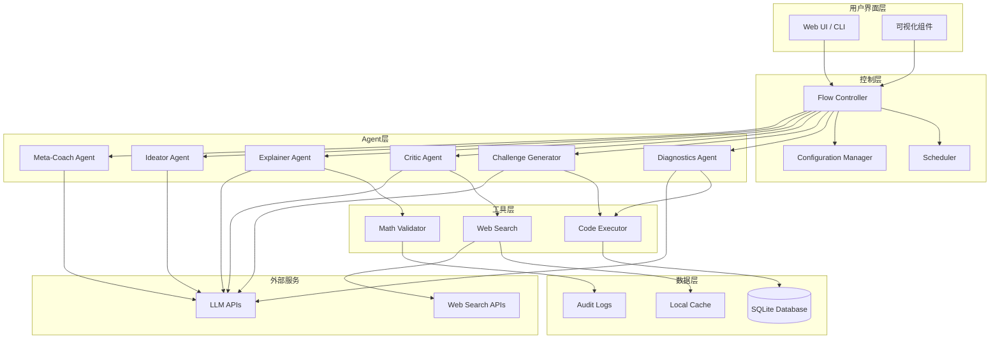
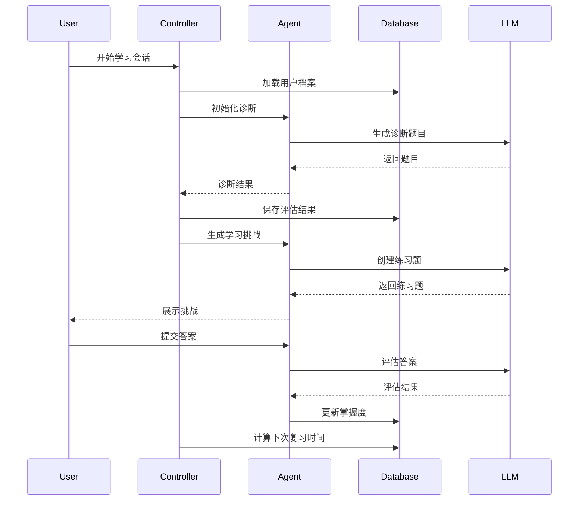

# Design Document - Cognitive Enhancement Agent

## Overview

认知增强Agent是一个基于MCP(Model Context Protocol)架构的本地化智能学习系统，旨在通过科学的学习理论和可插拔的模块化设计，为用户提供个性化的认知能力提升服务。

系统采用分层架构设计，将学习科学理论转化为可执行的Agent流程，通过多个专业化的Agent角色协同工作，实现诊断、教学、练习、评估、创新的完整学习闭环。

### 核心设计原则

1. **Unix哲学**: 每个组件专注单一功能，通过标准化接口通信
2. **可插拔架构**: 支持热插拔和动态配置，便于扩展和维护  
3. **本地优先**: 核心功能本地运行，保护用户隐私
4. **科学驱动**: 基于认知科学和学习科学的实证研究
5. **渐进增强**: 支持从基础到高级的能力逐步提升

## Architecture

### 系统架构图



### 分层架构详述

#### 1. 用户界面层 (Presentation Layer)
- **Web UI**: 基于现代Web技术的响应式界面
- **CLI**: 命令行接口，支持脚本化和自动化
- **可视化组件**: 遵循Tufte原则的数据可视化

#### 2. 控制层 (Control Layer)  
- **Flow Controller**: 核心编排引擎，管理Agent执行流程
- **Scheduler**: 基于SM-2算法的智能调度器
- **Configuration Manager**: 动态配置管理和热重载

#### 3. Agent层 (Agent Layer)
- **专业化Agent**: 每个Agent专注特定的学习功能
- **标准化接口**: 统一的输入输出格式
- **状态管理**: 维护学习上下文和历史记录

#### 4. 工具层 (Tool Layer)
- **代码执行器**: 安全的Python沙箱环境
- **网络搜索**: 集成LLM内置搜索能力
- **数学验证器**: 公式和计算验证

#### 5. 数据层 (Data Layer)
- **本地数据库**: SQLite存储学习记录和进度
- **缓存系统**: 提升响应速度和离线能力
- **审计日志**: 完整的操作记录和可追溯性

## Components and Interfaces

### Core Agent Components

#### 1. Diagnostics Agent
**职责**: 诊断用户知识水平和学习盲区

**输入接口**:
```json
{
  "topic": "string",
  "difficulty_level": "beginner|intermediate|advanced",
  "question_count": "integer",
  "focus_areas": ["string"]
}
```

**输出接口**:
```json
{
  "assessment_results": {
    "overall_score": "float",
    "bloom_levels": {
      "remember": "float",
      "understand": "float", 
      "apply": "float",
      "analyze": "float",
      "evaluate": "float",
      "create": "float"
    },
    "knowledge_gaps": ["string"],
    "recommended_path": "string"
  }
}
```

**核心算法**:
- 基于Bloom认知分类法生成分层测试题
- 使用项目反应理论(IRT)评估能力水平
- 识别知识图谱中的薄弱环节

#### 2. Challenge Generator Agent
**职责**: 生成基于检索练习的学习挑战

**输入接口**:
```json
{
  "topic": "string",
  "current_level": "float",
  "practice_type": "recall|application|synthesis",
  "difficulty_progression": "boolean"
}
```

**输出接口**:
```json
{
  "challenges": [
    {
      "id": "string",
      "type": "multiple_choice|fill_blank|code_completion|essay",
      "question": "string",
      "options": ["string"],
      "correct_answer": "string",
      "explanation": "string",
      "difficulty": "float",
      "cognitive_load": "low|medium|high"
    }
  ]
}
```

**核心算法**:
- 检索练习优先策略
- 认知负荷理论指导的难度调节
- 间隔重复算法优化

#### 3. Critic Agent  
**职责**: 基于批判性思维框架评估用户回答

**输入接口**:
```json
{
  "user_response": "string",
  "evaluation_criteria": ["accuracy", "clarity", "logic", "evidence"],
  "context": "string"
}
```

**输出接口**:
```json
{
  "evaluation": {
    "overall_score": "float",
    "paul_elder_scores": {
      "accuracy": "float",
      "precision": "float", 
      "relevance": "float",
      "logic": "float",
      "breadth": "float",
      "depth": "float",
      "significance": "float",
      "fairness": "float",
      "clarity": "float"
    },
    "identified_fallacies": ["string"],
    "improvement_suggestions": ["string"],
    "requires_revision": "boolean"
  }
}
```

**核心算法**:
- Paul-Elder批判性思维标准
- 逻辑谬误检测模式
- 论证结构分析

#### 4. Explainer Agent
**职责**: 实施费曼学习法，要求用户简化解释概念

**输入接口**:
```json
{
  "concept": "string",
  "target_audience": "child|layperson|peer",
  "explanation_format": "text|diagram|analogy"
}
```

**输出接口**:
```json
{
  "evaluation": {
    "clarity_score": "float",
    "accuracy_score": "float", 
    "completeness_score": "float",
    "missing_elements": ["string"],
    "suggested_analogies": ["string"],
    "requires_revision": "boolean"
  }
}
```

#### 5. Ideator Agent
**职责**: 激发创新思维，生成新想法和应用

**输入接口**:
```json
{
  "base_concept": "string",
  "innovation_method": "SCAMPER|TRIZ|lateral_thinking",
  "domain_constraints": ["string"]
}
```

**输出接口**:
```json
{
  "innovations": [
    {
      "idea": "string",
      "method_used": "string",
      "novelty_score": "float",
      "feasibility_score": "float",
      "potential_applications": ["string"]
    }
  ]
}
```

#### 6. Meta-Coach Agent
**职责**: 元认知监控和学习策略调整

**输入接口**:
```json
{
  "learning_session": {
    "duration": "integer",
    "performance_metrics": "object",
    "user_feedback": "string"
  }
}
```

**输出接口**:
```json
{
  "coaching_advice": {
    "motivation_level": "float",
    "cognitive_load_assessment": "string",
    "strategy_recommendations": ["string"],
    "break_suggestion": "boolean",
    "goal_adjustment": "string"
  }
}
```

### Supporting Components

#### Flow Controller
**职责**: 编排Agent执行流程和状态管理

**核心功能**:
- YAML/JSON配置的流程定义
- 条件分支和循环控制
- 错误处理和恢复机制
- 状态持久化和恢复

**流程配置示例**:
```yaml
flow:
  name: "deep_learning_session"
  steps:
    - agent: "diagnostics"
      config:
        topic: "${user_topic}"
        difficulty: "adaptive"
    - agent: "challenge_generator" 
      repeat: 3
      condition: "diagnostics.overall_score < 0.8"
    - agent: "critic"
      repeat_until: "score >= 0.8"
    - agent: "explainer"
      condition: "challenge_generator.success_rate > 0.7"
    - agent: "ideator"
      condition: "explainer.clarity_score > 0.8"
    - agent: "meta_coach"
      trigger: "session_end"
```

#### Scheduler
**职责**: 智能调度和间隔重复管理

**核心算法**:
```python
# SM-2算法实现
def calculate_next_interval(quality, repetition, easiness, interval):
    if quality >= 3:
        if repetition == 0:
            interval = 1
        elif repetition == 1:
            interval = 6
        else:
            interval = round(interval * easiness)
        repetition += 1
    else:
        repetition = 0
        interval = 1
    
    easiness = easiness + (0.1 - (5 - quality) * (0.08 + (5 - quality) * 0.02))
    if easiness < 1.3:
        easiness = 1.3
        
    return interval, repetition, easiness
```

## Data Models

### 核心数据模型

#### User Profile
```sql
CREATE TABLE user_profiles (
    id INTEGER PRIMARY KEY,
    username TEXT UNIQUE NOT NULL,
    learning_preferences JSON,
    cognitive_profile JSON,
    created_at TIMESTAMP DEFAULT CURRENT_TIMESTAMP,
    updated_at TIMESTAMP DEFAULT CURRENT_TIMESTAMP
);
```

#### Learning Session
```sql
CREATE TABLE learning_sessions (
    id INTEGER PRIMARY KEY,
    user_id INTEGER REFERENCES user_profiles(id),
    topic TEXT NOT NULL,
    session_type TEXT NOT NULL,
    start_time TIMESTAMP,
    end_time TIMESTAMP,
    performance_metrics JSON,
    agent_interactions JSON,
    FOREIGN KEY (user_id) REFERENCES user_profiles(id)
);
```

#### Knowledge Items
```sql
CREATE TABLE knowledge_items (
    id INTEGER PRIMARY KEY,
    user_id INTEGER REFERENCES user_profiles(id),
    concept TEXT NOT NULL,
    mastery_level REAL DEFAULT 0.0,
    last_reviewed TIMESTAMP,
    next_review TIMESTAMP,
    repetition_count INTEGER DEFAULT 0,
    easiness_factor REAL DEFAULT 2.5,
    interval_days INTEGER DEFAULT 1,
    FOREIGN KEY (user_id) REFERENCES user_profiles(id)
);
```

#### Assessment Results
```sql
CREATE TABLE assessments (
    id INTEGER PRIMARY KEY,
    session_id INTEGER REFERENCES learning_sessions(id),
    agent_type TEXT NOT NULL,
    input_data JSON,
    output_data JSON,
    evaluation_scores JSON,
    timestamp TIMESTAMP DEFAULT CURRENT_TIMESTAMP,
    FOREIGN KEY (session_id) REFERENCES learning_sessions(id)
);
```

### 数据流设计



## Error Handling

### 错误分类和处理策略

#### 1. 系统级错误
- **网络连接失败**: 自动切换到离线模式，使用缓存数据
- **LLM API限制**: 实施退避重试策略，降级到本地模型
- **数据库错误**: 事务回滚，数据一致性检查

#### 2. Agent级错误  
- **输出格式错误**: JSON schema验证，自动修复或重新生成
- **逻辑错误**: 多Agent交叉验证，异常检测
- **性能超时**: 任务分解，异步处理

#### 3. 用户级错误
- **输入验证失败**: 友好提示，引导正确输入
- **学习中断**: 状态保存，支持断点续传
- **理解困难**: 自动降低难度，提供额外支持

### 错误恢复机制

```python
class ErrorRecoveryManager:
    def __init__(self):
        self.retry_strategies = {
            'network_error': ExponentialBackoff(max_retries=3),
            'llm_error': FallbackToCache(),
            'validation_error': AutoCorrection(),
            'timeout_error': TaskDecomposition()
        }
    
    def handle_error(self, error_type, context):
        strategy = self.retry_strategies.get(error_type)
        if strategy:
            return strategy.execute(context)
        else:
            return self.default_recovery(error_type, context)
```

## Testing Strategy

### 测试层次和方法

#### 1. 单元测试
- **Agent功能测试**: 每个Agent的输入输出验证
- **算法正确性**: SM-2算法、评分算法的数学验证
- **数据模型测试**: 数据库操作和约束验证

#### 2. 集成测试
- **Agent协作测试**: 多Agent流程的端到端验证
- **外部服务集成**: LLM API和Web搜索的集成测试
- **数据一致性测试**: 跨组件的数据同步验证

#### 3. 性能测试
- **响应时间测试**: 各组件的性能基准
- **并发测试**: 多用户同时使用的压力测试
- **内存使用测试**: 长时间运行的内存泄漏检测

#### 4. 用户体验测试
- **学习效果验证**: A/B测试比较传统学习方法
- **可用性测试**: 用户界面和交互流程测试
- **认知负荷测试**: 学习过程中的认知负荷评估

### 测试自动化框架

```python
class CognitiveAgentTestSuite:
    def __init__(self):
        self.test_scenarios = [
            LearningPathTest(),
            KnowledgeRetentionTest(), 
            CriticalThinkingTest(),
            CreativityTest(),
            MetacognitionTest()
        ]
    
    def run_comprehensive_test(self):
        results = {}
        for test in self.test_scenarios:
            results[test.name] = test.execute()
        return self.generate_report(results)
```

### 质量指标

#### 学习效果指标
- **知识增益**: 前后测差值 > 0.8 SD
- **长期保持**: 30天后保留率 ≥ 60%
- **迁移能力**: 跨领域应用成功率 ≥ 70%

#### 系统性能指标  
- **响应时间**: 95%请求 < 2秒
- **可用性**: 99.5%正常运行时间
- **准确性**: Agent输出准确率 > 90%

#### 用户体验指标
- **满意度**: 用户评分 ≥ 4.5/5
- **参与度**: 会话完成率 ≥ 80%
- **学习动机**: 持续使用率 ≥ 70%

## Security and Privacy

### 隐私保护设计

#### 1. 数据最小化原则
- 仅收集必要的学习数据
- 定期清理过期数据
- 用户可控的数据保留策略

#### 2. 本地优先架构
- 核心数据本地存储和处理
- 网络传输仅限必要的查询关键词
- 支持完全离线模式运行

#### 3. 数据加密和安全
```python
class SecurityManager:
    def __init__(self):
        self.encryption_key = self.generate_user_key()
        self.data_classifier = DataClassifier()
    
    def encrypt_sensitive_data(self, data):
        if self.data_classifier.is_sensitive(data):
            return self.encrypt(data, self.encryption_key)
        return data
    
    def audit_data_access(self, operation, data_type):
        self.audit_log.record({
            'timestamp': datetime.now(),
            'operation': operation,
            'data_type': data_type,
            'user_consent': self.verify_consent(data_type)
        })
```

### 安全威胁防护

#### 1. 代码执行安全
- Python沙箱环境隔离
- 资源使用限制(CPU、内存、时间)
- 文件系统访问控制

#### 2. 输入验证和清理
- 所有用户输入的严格验证
- SQL注入和XSS防护
- 恶意代码检测

#### 3. API安全
- 访问令牌管理
- 请求频率限制
- 异常行为检测

## Performance Optimization

### 性能优化策略

#### 1. 缓存策略
```python
class IntelligentCache:
    def __init__(self):
        self.llm_response_cache = LRUCache(maxsize=1000)
        self.knowledge_graph_cache = TTLCache(maxsize=500, ttl=3600)
        self.user_profile_cache = WeakValueDictionary()
    
    def get_cached_response(self, query_hash):
        return self.llm_response_cache.get(query_hash)
    
    def cache_response(self, query_hash, response, ttl=None):
        self.llm_response_cache[query_hash] = {
            'response': response,
            'timestamp': time.time(),
            'ttl': ttl
        }
```

#### 2. 异步处理
- 非阻塞的Agent执行
- 后台任务队列处理
- 流式响应和渐进式加载

#### 3. 资源管理
- 智能的模型加载和卸载
- 内存池管理
- 连接池优化

### 扩展性设计

#### 1. 水平扩展支持
- 无状态Agent设计
- 分布式任务调度
- 负载均衡策略

#### 2. 插件生态系统
```python
class PluginManager:
    def __init__(self):
        self.registered_plugins = {}
        self.plugin_dependencies = DependencyGraph()
    
    def register_plugin(self, plugin_class):
        plugin_info = plugin_class.get_plugin_info()
        self.registered_plugins[plugin_info.name] = plugin_class
        self.plugin_dependencies.add_node(plugin_info)
    
    def load_plugins(self, config):
        load_order = self.plugin_dependencies.topological_sort()
        for plugin_name in load_order:
            if plugin_name in config.enabled_plugins:
                self.instantiate_plugin(plugin_name, config)
```

这个设计文档提供了认知增强Agent系统的完整技术架构，涵盖了从高层设计到具体实现的各个方面。系统采用模块化、可扩展的设计，确保能够随着技术发展和用户需求的变化而持续演进。