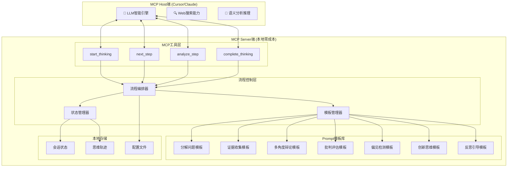
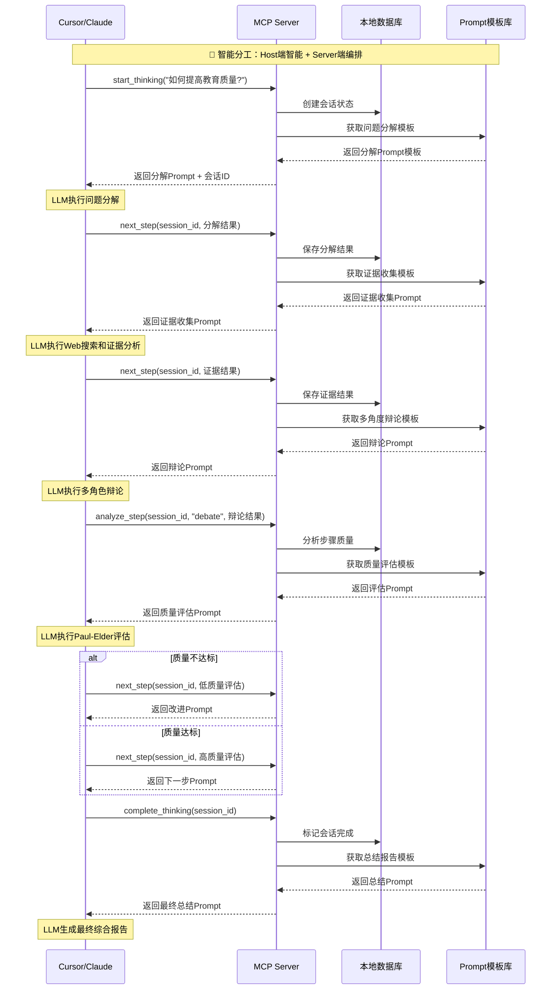

# Design Document - Deep Thinking Engine

## Overview

深度思考引擎是一个**零成本本地MCP Server**，专为Cursor等按用户请求计算的订阅制MCP Host设计。系统遵循**智能分工原则**：

- 🧠 **MCP Host端 LLM**：负责复杂的语义分析和智能生成
- 🔧 **MCP Server端**：提供简洁的流程控制和Prompt模板管理，**零LLM API调用**

通过精心设计的Prompt模板和流程编排，系统将批判性思维、创新思维、元认知等科学方法转化为可执行的思维流程，充分榨干LLM的智能潜力，实现深度思考的成本优势。

### 核心设计原则

1. **零成本运行**: MCP Server端不调用任何LLM API，纯本地流程控制
2. **智能分工**: Host端LLM负责智能，Server端负责编排和模板管理
3. **成本优势**: 充分利用订阅制收费模式，避免多轮调用费用
4. **Prompt驱动**: 通过精心设计的Prompt模板引导LLM深度思考
5. **流程编排**: 科学的思维方法转化为可执行的步骤序列
6. **模板管理**: 可配置的Prompt模板库，支持自定义思维策略

## Architecture

### 智能分工架构图



### 核心设计理念

#### 🧠 MCP Host端职责
- **语义理解**: 理解用户问题的深层含义
- **智能生成**: 根据Prompt模板生成高质量内容
- **推理分析**: 执行复杂的逻辑推理和分析
- **Web搜索**: 利用内置搜索获取外部信息
- **内容创作**: 生成论证、反驳、创新想法等

#### 🔧 MCP Server端职责
- **流程编排**: 管理深度思考的步骤序列
- **状态维护**: 跟踪思维过程的当前状态
- **模板管理**: 提供精心设计的Prompt模板
- **会话管理**: 维护多轮对话的上下文
- **零API调用**: 纯本地逻辑，不消耗任何LLM API

### MCP工具接口设计

#### 核心MCP工具

所有MCP工具都返回**Prompt模板**而非最终结果，让Host端LLM执行实际的智能处理：

```python
# MCP Server端工具示例
@mcp_tool
def start_thinking(topic: str, complexity: str = "moderate") -> dict:
    """开始深度思考流程"""
    session_id = create_new_session(topic)
    
    # 返回给LLM的是Prompt模板，不是处理结果
    return {
        "session_id": session_id,
        "next_step": "decompose_problem",
        "prompt_template": get_decomposition_prompt(topic, complexity),
        "instructions": "请按照以下模板分解问题，确保覆盖多个角度和层次",
        "expected_output_format": "JSON格式的子问题列表"
    }

@mcp_tool  
def next_step(session_id: str, previous_result: str) -> dict:
    """获取下一步思维指令"""
    session = get_session(session_id)
    current_step = session.current_step
    
    # 根据当前步骤返回相应的Prompt模板
    next_step_info = determine_next_step(current_step, previous_result)
    
    return {
        "session_id": session_id,
        "step_name": next_step_info["name"],
        "prompt_template": next_step_info["template"],
        "instructions": next_step_info["instructions"],
        "context": session.get_context(),
        "previous_results": session.get_previous_results()
    }
```

## Components and Interfaces

### MCP工具详细设计

#### 1. start_thinking - 开始深度思考
**职责**: 初始化思考会话，返回问题分解Prompt模板

**MCP工具接口**:
```python
@mcp_tool
def start_thinking(topic: str, complexity: str = "moderate", focus: str = "") -> dict:
    """开始深度思考流程，返回问题分解的Prompt模板"""
    session_id = create_session(topic)
    
    return {
        "session_id": session_id,
        "step": "decompose_problem",
        "prompt_template": f"""
# 深度思考：问题分解

你是一位专业的问题分析专家。请将以下复杂问题分解为可管理的子问题：

**主要问题**: {topic}
**复杂度**: {complexity}
**关注重点**: {focus}

## 分解要求：
1. 将主问题分解为3-7个核心子问题
2. 每个子问题应该相对独立且可深入分析
3. 确保覆盖问题的不同角度和层面
4. 识别子问题之间的依赖关系

## 输出格式：
请以JSON格式输出，包含：
- main_question: 主要问题
- sub_questions: 子问题列表，每个包含：
  - id: 唯一标识
  - question: 子问题描述
  - priority: high/medium/low
  - search_keywords: 搜索关键词列表
  - expected_perspectives: 预期分析角度
- relationships: 子问题间的依赖关系

开始分解：
""",
        "instructions": "请严格按照JSON格式输出分解结果",
        "next_action": "调用next_step工具继续流程"
    }
```

#### 2. next_step - 获取下一步指令
**职责**: 根据当前进度返回下一步的Prompt模板

**MCP工具接口**:
```python
@mcp_tool
def next_step(session_id: str, step_result: str) -> dict:
    """获取思考流程的下一步Prompt模板"""
    session = get_session(session_id)
    session.add_result(step_result)
    
    next_step_info = determine_next_step(session)
    
    return {
        "session_id": session_id,
        "step": next_step_info["step_name"],
        "prompt_template": next_step_info["template"],
        "context": session.get_context_summary(),
        "instructions": next_step_info["instructions"]
    }
```

### Prompt模板库设计

#### 问题分解模板 (Decomposition Template)
```python
DECOMPOSITION_TEMPLATE = """
# 深度思考：问题分解

你是一位专业的问题分析专家。请将复杂问题系统性地分解：

**主要问题**: {topic}
**复杂度级别**: {complexity}
**领域背景**: {domain_context}

## 分解策略：
1. **核心要素分解**: 识别问题的关键组成部分
2. **时间维度分解**: 考虑短期、中期、长期影响
3. **利益相关者分解**: 分析不同角色的视角
4. **因果关系分解**: 探索原因、过程、结果

## 输出要求：
- 3-7个相互独立的子问题
- 每个子问题都可以独立深入研究
- 标注优先级和预期争议点
- 提供搜索关键词建议

请开始分解：
"""
```

#### 证据收集模板 (Evidence Collection Template)
```python
EVIDENCE_TEMPLATE = """
# 深度思考：证据收集

你现在需要为以下子问题收集全面、可靠的证据：

**子问题**: {sub_question}
**搜索关键词**: {keywords}
**证据要求**: 多样化来源，高可信度

## 搜索策略：
1. **学术来源**: 搜索学术论文、研究报告
2. **权威机构**: 政府报告、国际组织数据
3. **新闻媒体**: 最新发展和案例分析
4. **专家观点**: 行业专家的分析和评论

## 请执行以下步骤：
1. 使用你的Web搜索能力查找相关信息
2. 评估每个来源的可信度
3. 提取关键事实和数据
4. 识别相互冲突的信息

## 输出格式：
请整理为结构化的证据集合，包含来源、可信度评分、关键发现等。

开始搜索和分析：
"""
```

#### 多角度辩论模板 (Multi-Perspective Debate Template)
```python
DEBATE_TEMPLATE = """
# 深度思考：多角度辩论

基于收集的证据，现在需要从多个角度深入辩论：

**辩论主题**: {topic}
**可用证据**: {evidence_summary}

## 辩论角色设定：
你需要分别扮演以下角色进行辩论：

### 🟢 支持方 (Proponent)
- 立场：支持该观点/方案
- 任务：提出最强有力的支持论据
- 要求：基于证据，逻辑清晰

### 🔴 反对方 (Opponent)  
- 立场：质疑或反对该观点/方案
- 任务：指出潜在问题和风险
- 要求：批判性思维，有理有据

### 🟡 中立方 (Neutral Analyst)
- 立场：客观分析各方观点
- 任务：平衡评估，寻找中间路径
- 要求：公正客观，综合考量

## 辩论流程：
1. 各方陈述核心观点 (150字以内)
2. 相互质疑和反驳 (每轮100字以内)
3. 最终总结各方最强论点

请开始三方辩论：
"""
```

#### 批判性评估模板 (Critical Evaluation Template)
```python
CRITICAL_EVALUATION_TEMPLATE = """
# 深度思考：批判性评估

请基于Paul-Elder批判性思维标准评估以下内容：

**评估内容**: {content}
**评估背景**: {context}

## Paul-Elder九大标准评估：

### 1. 准确性 (Accuracy)
- 信息是否准确无误？
- 有无事实错误？
- 评分：1-10分，理由：

### 2. 精确性 (Precision)  
- 表述是否具体明确？
- 有无模糊不清之处？
- 评分：1-10分，理由：

### 3. 相关性 (Relevance)
- 内容是否与主题相关？
- 有无偏离核心问题？
- 评分：1-10分，理由：

### 4. 逻辑性 (Logic)
- 推理是否合乎逻辑？
- 有无逻辑谬误？
- 评分：1-10分，理由：

### 5. 广度 (Breadth)
- 是否考虑了多个角度？
- 视野是否足够宽广？
- 评分：1-10分，理由：

### 6. 深度 (Depth)
- 分析是否深入透彻？
- 是否触及根本问题？
- 评分：1-10分，理由：

### 7. 重要性 (Significance)
- 关注的是否为核心问题？
- 优先级是否合理？
- 评分：1-10分，理由：

### 8. 公正性 (Fairness)
- 是否存在偏见？
- 对不同观点是否公平？
- 评分：1-10分，理由：

### 9. 清晰性 (Clarity)
- 表达是否清晰易懂？
- 结构是否条理清楚？
- 评分：1-10分，理由：

## 总体评估：
- 综合得分：___/90分
- 主要优势：
- 改进建议：
- 是否需要重新分析：是/否

请开始详细评估：
"""
```

#### 偏见检测模板 (Bias Detection Template)
```python
BIAS_DETECTION_TEMPLATE = """
# 深度思考：认知偏见检测

请仔细分析以下内容中可能存在的认知偏见：

**分析内容**: {content}
**分析背景**: {context}

## 常见认知偏见检查清单：

### 🔍 确认偏误 (Confirmation Bias)
- 是否只寻找支持既有观点的信息？
- 是否忽略了相反的证据？
- 检测结果：存在/不存在，证据：

### ⚓ 锚定效应 (Anchoring Bias)
- 是否过度依赖最初获得的信息？
- 后续判断是否受到初始印象影响？
- 检测结果：存在/不存在，证据：

### 📊 可得性启发 (Availability Heuristic)
- 是否因为某些例子容易想起就认为更常见？
- 判断是否受到媒体报道频率影响？
- 检测结果：存在/不存在，证据：

### 🎯 代表性启发 (Representativeness Heuristic)
- 是否基于刻板印象进行判断？
- 是否忽略了基础概率？
- 检测结果：存在/不存在，证据：

### 💪 过度自信 (Overconfidence Bias)
- 对自己的判断是否过于确信？
- 是否低估了不确定性？
- 检测结果：存在/不存在，证据：

### 🔄 后见之明偏误 (Hindsight Bias)
- 是否认为结果"早就可以预见"？
- 是否重新解释了历史？
- 检测结果：存在/不存在，证据：

## 偏见缓解建议：
请针对检测到的偏见提供具体的缓解策略：
1. 
2. 
3. 

## 总体评估：
- 偏见风险等级：低/中/高
- 主要偏见类型：
- 改进优先级：

请开始详细分析：
"""
```

#### 创新思维模板 (Innovation Template)
```python
INNOVATION_TEMPLATE = """
# 深度思考：创新思维激发

使用{method}方法对以下概念进行创新思考：

**基础概念**: {concept}
**创新方向**: {direction}
**约束条件**: {constraints}

## SCAMPER创新技法：

### S - Substitute (替代)
- 可以用什么来替代现有的元素？
- 有哪些材料、流程、人员可以替换？
- 创新想法：

### C - Combine (结合)
- 可以将哪些元素结合起来？
- 能否融合不同领域的概念？
- 创新想法：

### A - Adapt (适应)
- 可以从其他领域借鉴什么？
- 有哪些成功案例可以适应？
- 创新想法：

### M - Modify (修改)
- 可以放大或缩小什么？
- 能否改变形状、颜色、功能？
- 创新想法：

### P - Put to Other Uses (其他用途)
- 还有什么其他用途？
- 能否应用到不同场景？
- 创新想法：

### E - Eliminate (消除)
- 可以去掉什么不必要的部分？
- 能否简化流程？
- 创新想法：

### R - Reverse/Rearrange (逆转/重组)
- 能否颠倒顺序或角色？
- 可以重新排列哪些元素？
- 创新想法：

## 跨领域启发：
从以下领域寻找灵感：
- 自然界：
- 艺术：
- 科技：
- 历史：

## 创新评估：
对生成的想法进行评估：
1. 新颖性 (1-10分)：
2. 可行性 (1-10分)：
3. 价值潜力 (1-10分)：
4. 实施难度 (1-10分)：

请开始创新思考：
"""
```

#### 反思引导模板 (Reflection Template)
```python
REFLECTION_TEMPLATE = """
# 深度思考：苏格拉底式反思

现在让我们对整个思考过程进行深度反思：

**思考主题**: {topic}
**思考历程**: {thinking_history}
**当前结论**: {current_conclusions}

## 苏格拉底式提问：

### 🤔 过程反思 (Process Reflection)
1. **我是如何得出这些结论的？**
   - 我使用了哪些思维方法？
   - 我的推理过程是否合理？
   - 反思：

2. **我考虑了哪些角度？**
   - 是否遗漏了重要视角？
   - 不同利益相关者的观点如何？
   - 反思：

3. **我的证据是否充分？**
   - 证据的质量和可信度如何？
   - 是否存在相互矛盾的证据？
   - 反思：

### 🎯 结果反思 (Outcome Reflection)
4. **我的结论有多确定？**
   - 哪些部分我很确信？
   - 哪些部分还存在不确定性？
   - 反思：

5. **如果我错了会怎样？**
   - 最坏的情况是什么？
   - 如何降低错误的风险？
   - 反思：

6. **还有其他可能的解释吗？**
   - 是否存在我没有考虑的替代方案？
   - 如何验证我的结论？
   - 反思：

### 🧠 元认知反思 (Metacognitive Reflection)
7. **我的思维模式如何？**
   - 我倾向于使用哪些思维方式？
   - 我有哪些思维盲点？
   - 反思：

8. **我学到了什么？**
   - 这次思考让我获得了什么新见解？
   - 我的思维能力有何提升？
   - 反思：

9. **下次如何改进？**
   - 我可以在哪些方面做得更好？
   - 需要培养哪些新的思维技能？
   - 反思：

## 最终总结：
- **核心洞察**：
- **主要收获**：
- **行动计划**：
- **持续思考的问题**：

请开始深度反思：
"""
```

#### 3. analyze_step - 分析步骤结果
**职责**: 分析当前步骤的执行结果，决定是否需要调整

**MCP工具接口**:
```python
@mcp_tool
def analyze_step(session_id: str, step_name: str, step_result: str) -> dict:
    """分析步骤执行结果，提供质量评估和改进建议"""
    session = get_session(session_id)
    
    # 根据步骤类型选择相应的分析模板
    analysis_template = get_analysis_template(step_name, step_result)
    
    return {
        "session_id": session_id,
        "step_analyzed": step_name,
        "analysis_prompt": analysis_template,
        "quality_check": True,
        "improvement_suggestions": get_improvement_suggestions(step_name),
        "next_recommendation": determine_next_action(session, step_result)
    }
```

#### 4. complete_thinking - 完成思考流程
**职责**: 总结整个思考过程，生成最终报告

**MCP工具接口**:
```python
@mcp_tool
def complete_thinking(session_id: str) -> dict:
    """完成思考流程，生成综合报告"""
    session = get_session(session_id)
    session.status = "completed"
    
    return {
        "session_id": session_id,
        "status": "completed",
        "summary_prompt": f"""
# 深度思考总结报告

## 思考主题
{session.topic}

## 思考历程
{session.get_step_summary()}

## 请生成综合报告：

### 1. 核心发现
- 主要结论：
- 关键洞察：
- 重要发现：

### 2. 证据支撑
- 最有力的证据：
- 证据质量评估：
- 不确定性分析：

### 3. 多角度分析
- 支持观点：
- 反对观点：
- 中立分析：

### 4. 创新思路
- 新颖想法：
- 实施建议：
- 风险评估：

### 5. 反思总结
- 思维过程评价：
- 学习收获：
- 改进方向：

请生成详细的综合报告：
""",
        "thinking_trace": session.get_full_trace(),
        "quality_metrics": session.calculate_quality_metrics()
    }
```

### 流程编排系统

#### 思维流程定义
```yaml
# 深度思考流程配置
thinking_flows:
  comprehensive_analysis:
    name: "全面深度分析"
    description: "适用于复杂问题的全面分析流程"
    steps:
      - step: "decompose_problem"
        template: "decomposition"
        required: true
        
      - step: "collect_evidence"
        template: "evidence_collection"
        parallel: true
        for_each: "sub_questions"
        
      - step: "multi_perspective_debate"
        template: "debate"
        depends_on: ["collect_evidence"]
        
      - step: "critical_evaluation"
        template: "critical_evaluation"
        quality_gate: 0.8
        
      - step: "bias_detection"
        template: "bias_detection"
        
      - step: "innovation_thinking"
        template: "innovation"
        conditional: "evaluation_score >= 0.8"
        
      - step: "reflection"
        template: "reflection"
        final: true

  quick_analysis:
    name: "快速分析"
    description: "适用于简单问题的快速分析流程"
    steps:
      - step: "simple_decompose"
        template: "simple_decomposition"
        
      - step: "basic_evidence"
        template: "basic_evidence"
        
      - step: "quick_evaluation"
        template: "basic_evaluation"
        
      - step: "brief_reflection"
        template: "brief_reflection"
```

### 状态管理系统

#### 会话状态模型
```python
class ThinkingSession:
    def __init__(self, topic: str, flow_type: str = "comprehensive_analysis"):
        self.id = generate_session_id()
        self.topic = topic
        self.flow_type = flow_type
        self.current_step = 0
        self.status = "active"
        self.steps_completed = []
        self.step_results = {}
        self.context = {}
        self.quality_scores = {}
        self.created_at = datetime.now()
        
    def add_step_result(self, step_name: str, result: str, quality_score: float = None):
        """添加步骤执行结果"""
        self.step_results[step_name] = {
            "result": result,
            "quality_score": quality_score,
            "timestamp": datetime.now()
        }
        self.steps_completed.append(step_name)
        
    def get_context_summary(self) -> str:
        """获取当前上下文摘要"""
        return {
            "topic": self.topic,
            "completed_steps": self.steps_completed,
            "current_progress": f"{len(self.steps_completed)}/{self.get_total_steps()}",
            "key_findings": self.extract_key_findings()
        }
```

## Data Models

### 核心数据模型

#### Thinking Session
```sql
CREATE TABLE thinking_sessions (
    id INTEGER PRIMARY KEY,
    user_id TEXT,
    topic TEXT NOT NULL,
    session_type TEXT DEFAULT 'comprehensive_analysis',
    start_time TIMESTAMP DEFAULT CURRENT_TIMESTAMP,
    end_time TIMESTAMP,
    status TEXT DEFAULT 'active',
    configuration JSON,
    final_results JSON,
    quality_metrics JSON
);
```

#### Agent Interactions
```sql
CREATE TABLE agent_interactions (
    id INTEGER PRIMARY KEY,
    session_id INTEGER REFERENCES thinking_sessions(id),
    agent_type TEXT NOT NULL,
    role TEXT NOT NULL,
    input_data JSON,
    output_data JSON,
    execution_time REAL,
    quality_score REAL,
    timestamp TIMESTAMP DEFAULT CURRENT_TIMESTAMP,
    parent_interaction_id INTEGER REFERENCES agent_interactions(id)
);
```

#### Evidence Sources
```sql
CREATE TABLE evidence_sources (
    id INTEGER PRIMARY KEY,
    session_id INTEGER REFERENCES thinking_sessions(id),
    url TEXT,
    title TEXT,
    summary TEXT,
    credibility_score REAL,
    source_type TEXT,
    publication_date TEXT,
    key_claims JSON,
    citation_count INTEGER DEFAULT 0
);
```

#### Thinking Traces
```sql
CREATE TABLE thinking_traces (
    id INTEGER PRIMARY KEY,
    session_id INTEGER REFERENCES thinking_sessions(id),
    step_number INTEGER,
    agent_type TEXT,
    thought_content TEXT,
    evidence_references JSON,
    evaluation_scores JSON,
    bias_flags JSON,
    timestamp TIMESTAMP DEFAULT CURRENT_TIMESTAMP
);
```

### 零成本MCP数据流设计



## Error Handling

### 零成本错误处理策略

#### 1. MCP工具调用错误
```python
class MCPErrorHandler:
    def __init__(self):
        self.fallback_templates = {
            'session_not_found': self.get_session_recovery_prompt,
            'invalid_step_result': self.get_format_correction_prompt,
            'template_missing': self.get_generic_template,
            'flow_interrupted': self.get_flow_recovery_prompt
        }
    
    def handle_mcp_error(self, error_type: str, context: dict) -> dict:
        """处理MCP工具调用错误，返回恢复Prompt"""
        if error_type in self.fallback_templates:
            return self.fallback_templates[error_type](context)
        else:
            return self.get_generic_error_prompt(error_type, context)
    
    def get_session_recovery_prompt(self, context: dict) -> dict:
        return {
            "error_type": "session_recovery",
            "prompt_template": """
# 会话恢复

抱歉，之前的思考会话似乎中断了。让我们重新开始：

**原始问题**: {original_topic}

请选择以下选项之一：
1. 重新开始完整的深度思考流程
2. 从特定步骤继续（如果你记得之前的进展）
3. 进行快速分析

请告诉我你希望如何继续：
""",
            "instructions": "请选择继续方式，我将为你提供相应的思考框架"
        }
```

#### 2. 流程状态错误
- **会话丢失**: 提供会话恢复Prompt，让用户选择重新开始或继续
- **步骤跳跃**: 返回步骤确认Prompt，确保流程连贯性
- **格式错误**: 提供格式修正Prompt，指导正确的输出格式

#### 3. 模板管理错误
- **模板缺失**: 使用通用模板作为后备方案
- **配置错误**: 返回配置检查Prompt，引导用户修正
- **流程中断**: 提供流程恢复选项，让用户决定如何继续

## Testing Strategy

### 零成本MCP测试策略

#### 1. MCP工具测试
```python
class TestMCPTools:
    def test_start_thinking_tool(self):
        """测试开始思考工具返回正确的Prompt模板"""
        result = start_thinking("如何提高学习效率?", "moderate")
        
        assert "session_id" in result
        assert "prompt_template" in result
        assert "问题分解" in result["prompt_template"]
        assert "JSON格式" in result["instructions"]
    
    def test_next_step_tool(self):
        """测试下一步工具的流程控制"""
        session_id = create_test_session()
        result = next_step(session_id, '{"sub_questions": [...]}')
        
        assert result["step"] == "collect_evidence"
        assert "证据收集" in result["prompt_template"]
        assert "Web搜索" in result["prompt_template"]
    
    def test_template_management(self):
        """测试模板管理系统"""
        template = get_template("decomposition", {"topic": "测试问题"})
        
        assert "测试问题" in template
        assert "分解要求" in template
        assert "输出格式" in template
```

#### 2. 流程编排测试
- **会话状态管理**: 验证会话创建、更新、完成流程
- **模板选择逻辑**: 确保根据步骤正确选择Prompt模板
- **流程控制**: 测试条件分支和循环控制逻辑

#### 3. Prompt模板测试
- **模板完整性**: 验证所有必要的Prompt模板都存在
- **模板格式**: 确保模板格式正确，包含必要的占位符
- **模板逻辑**: 测试模板中的指令逻辑是否清晰有效

### 质量保证指标

#### MCP工具质量指标
- **工具响应时间**: < 100ms (纯本地处理)
- **模板完整性**: 100% 覆盖所有思维步骤
- **会话管理准确性**: 99.9% 状态一致性

#### Prompt模板质量指标
- **模板可用性**: 100% 模板可正常加载
- **指令清晰度**: 人工评估 ≥ 9/10分
- **输出格式规范**: 结构化输出成功率 ≥ 95%

## Security and Privacy

### 零成本隐私保护设计

#### 1. 纯本地MCP Server
```python
class ZeroCostPrivacyManager:
    def __init__(self):
        self.local_session_manager = LocalSessionManager()
        self.template_manager = TemplateManager()
    
    def handle_thinking_request(self, user_input: str) -> dict:
        """处理思考请求，完全本地化，零网络调用"""
        # 创建本地会话
        session = self.local_session_manager.create_session(user_input)
        
        # 返回Prompt模板，不进行任何智能处理
        return {
            "session_id": session.id,
            "prompt_template": self.template_manager.get_initial_template(user_input),
            "privacy_status": "完全本地处理，零数据泄露风险"
        }
```

#### 2. 本地数据存储
- **SQLite本地数据库**: 所有会话数据存储在用户本地
- **无云端同步**: 不向任何外部服务发送数据
- **用户完全控制**: 用户可随时删除所有本地数据

#### 3. 零网络通信
- **MCP Server端**: 完全离线运行，不发起任何网络请求
- **Host端搜索**: 由Cursor/Claude的内置搜索能力处理
- **数据隔离**: 思维过程数据完全在用户设备上

## Performance Optimization

### 零成本性能优化策略

#### 1. 轻量级本地缓存
```python
class LocalCache:
    def __init__(self):
        self.template_cache = {}  # 内存中缓存常用模板
        self.session_cache = {}   # 缓存活跃会话状态
    
    def get_template(self, template_name: str, params: dict) -> str:
        """获取缓存的模板，避免重复文件读取"""
        cache_key = f"{template_name}_{hash(str(params))}"
        if cache_key not in self.template_cache:
            self.template_cache[cache_key] = self.load_template(template_name, params)
        return self.template_cache[cache_key]
    
    def cache_session_state(self, session_id: str, state: dict):
        """缓存会话状态，减少数据库访问"""
        self.session_cache[session_id] = state
```

#### 2. 高效流程控制
- **状态机优化**: 使用轻量级状态机管理思维流程
- **模板预加载**: 启动时预加载常用Prompt模板
- **增量更新**: 只更新变化的会话状态部分

#### 3. 资源使用最小化
- **内存优化**: 及时清理不活跃的会话缓存
- **磁盘优化**: 使用SQLite WAL模式提高并发性能
- **CPU优化**: 避免复杂计算，专注于简单的模板替换和状态管理

## Implementation Benefits

### 🎯 核心优势总结

#### 1. 成本优势
- **零API费用**: MCP Server端不调用任何LLM API
- **订阅制友好**: 充分利用Cursor等工具的按用户请求计费模式
- **多轮推理零成本**: 复杂的多步思维流程不产生额外费用

#### 2. 隐私优势
- **数据本地化**: 所有思维内容完全在用户设备上
- **零数据泄露**: 不向任何外部服务发送敏感信息
- **用户控制**: 用户完全掌控自己的思维数据

#### 3. 性能优势
- **响应迅速**: 本地模板管理，毫秒级响应
- **离线可用**: 完全不依赖网络连接
- **资源轻量**: 最小化系统资源占用

#### 4. 扩展优势
- **模板可定制**: 用户可自定义思维流程和Prompt模板
- **流程可配置**: 支持不同复杂度的思维流程
- **集成友好**: 标准MCP协议，易于集成到各种Host环境

### 🚀 与传统方案对比

| 特性 | 传统Agent方案 | 零成本MCP方案 |
|------|---------------|---------------|
| **成本** | 高昂的多轮API调用费用 | 完全零成本 |
| **隐私** | 数据发送到外部服务 | 完全本地化 |
| **响应速度** | 依赖网络和API响应 | 毫秒级本地响应 |
| **可定制性** | 固定的Agent逻辑 | 灵活的模板系统 |
| **离线能力** | 完全依赖网络 | 完全离线可用 |
| **集成复杂度** | 需要复杂的Agent编排 | 简单的MCP工具调用 |

这个设计完全符合你的**智能分工原则**：让昂贵的LLM专注于智能生成，让免费的本地MCP专注于流程编排，实现深度思考的成本最优化。