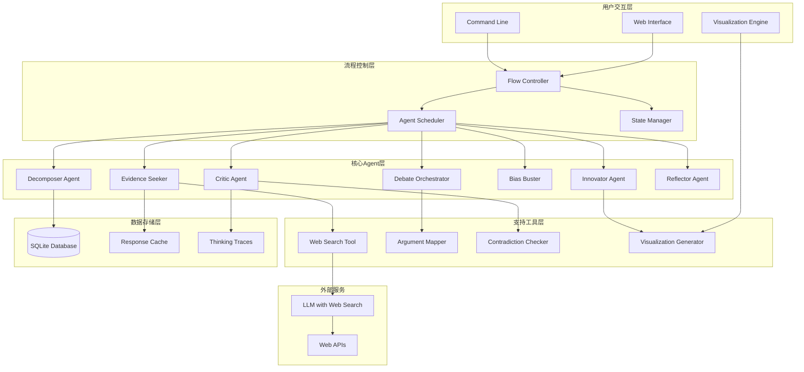
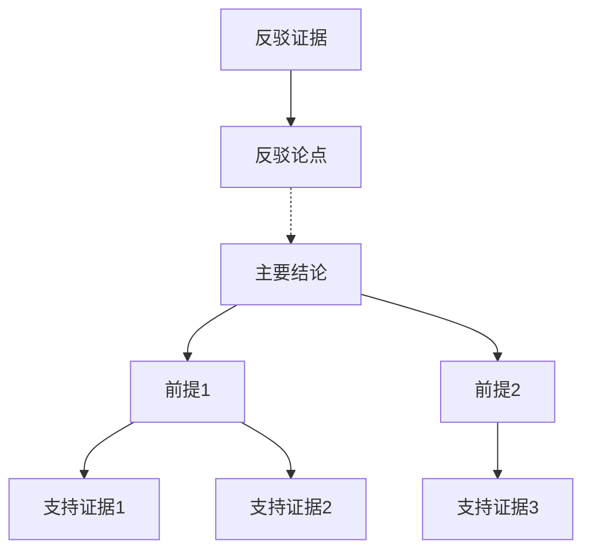
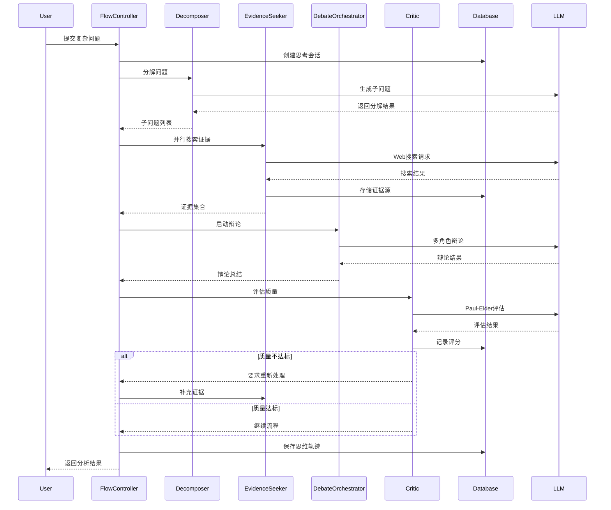

# Design Document - Deep Thinking Engine

## Overview

深度思考引擎是一个基于MCP(Model Context Protocol)架构的本地化智能思维系统，旨在通过科学的思维方法和多Agent协作，帮助用户突破认知局限，进行系统性的深度思考。

系统采用"LLM负责生成-推理，MCP负责编排-监督"的核心设计理念，将批判性思维、创新思维、元认知等科学方法转化为可执行的Agent流程，通过多轮辩论、证据搜索、偏见检测等机制，实现可追溯、可验证的深度思考过程。

### 核心设计原则

1. **思维科学驱动**: 基于Paul-Elder标准、苏格拉底提问法等实证方法
2. **多Agent协作**: 通过角色分工和辩论机制避免单一视角局限
3. **证据导向**: 结合LLM Web搜索能力，确保论证有据可依
4. **可视化透明**: 提供论证映射和思维足迹，降低认知负荷
5. **本地优先**: 核心推理本地化，保护思维隐私
6. **可插拔架构**: 支持自定义思维策略和评估标准

## Architecture

### 系统架构图



### 分层架构详述

#### 1. 用户交互层 (Interaction Layer)
- **Web Interface**: 现代化的响应式Web界面，支持实时思维过程展示
- **Command Line**: CLI接口，支持批处理和自动化场景
- **Visualization Engine**: 基于D3.js/Mermaid的可视化引擎

#### 2. 流程控制层 (Control Layer)
- **Flow Controller**: 核心编排引擎，管理思维流程的执行顺序
- **Agent Scheduler**: 智能调度器，优化Agent执行和资源分配
- **State Manager**: 状态管理器，维护思维上下文和会话状态

#### 3. 核心Agent层 (Agent Layer)
- **专业化Agent**: 每个Agent专注特定的思维功能
- **角色化设计**: 基于认知科学理论的角色定义
- **协作机制**: Agent间的信息传递和协调机制

#### 4. 支持工具层 (Tool Layer)
- **搜索工具**: 集成LLM内置搜索和外部API
- **论证映射**: 自动生成论证结构图
- **矛盾检测**: 逻辑一致性验证工具

#### 5. 数据存储层 (Storage Layer)
- **本地数据库**: 加密的SQLite存储
- **智能缓存**: 多层缓存优化性能
- **思维轨迹**: 完整的推理过程记录

## Components and Interfaces

### Core Agent Components

#### 1. Decomposer Agent (问题分解者)
**职责**: 将复杂问题分解为可管理的子问题

**输入接口**:
```json
{
  "user_question": "string",
  "complexity_level": "simple|moderate|complex",
  "domain_context": "string",
  "focus_constraints": ["string"]
}
```

**输出接口**:
```json
{
  "decomposition": {
    "main_question": "string",
    "sub_questions": [
      {
        "id": "string",
        "question": "string",
        "priority": "high|medium|low",
        "search_keywords": ["string"],
        "expected_perspectives": ["string"],
        "potential_controversies": ["string"]
      }
    ],
    "question_relationships": [
      {
        "from": "string",
        "to": "string", 
        "relationship": "prerequisite|parallel|dependent"
      }
    ]
  }
}
```

**核心算法**:
- 基于问题复杂度的递归分解策略
- 关键词提取和语义聚类
- 争议点预测和视角多样性保证

#### 2. Evidence Seeker (证据猎手)
**职责**: 利用LLM Web搜索获取多源证据

**输入接口**:
```json
{
  "sub_question": "string",
  "search_keywords": ["string"],
  "source_diversity_requirement": "boolean",
  "credibility_threshold": "float"
}
```

**输出接口**:
```json
{
  "evidence_collection": {
    "query_used": "string",
    "sources": [
      {
        "id": "string",
        "url": "string",
        "title": "string",
        "summary": "string",
        "credibility_score": "float",
        "source_type": "academic|news|government|blog",
        "publication_date": "string",
        "key_claims": ["string"]
      }
    ],
    "source_diversity_score": "float",
    "conflicting_information": [
      {
        "claim_a": "string",
        "claim_b": "string",
        "sources": ["string"]
      }
    ]
  }
}
```

**核心算法**:
- 多样化搜索策略(学术、新闻、政府等)
- 信源可信度评估算法
- 信息冲突自动检测

#### 3. Debate Orchestrator (辩论编排者)
**职责**: 组织多Agent辩论，确保多视角分析

**输入接口**:
```json
{
  "topic": "string",
  "evidence_base": "object",
  "debate_positions": ["string"],
  "max_rounds": "integer"
}
```

**输出接口**:
```json
{
  "debate_results": {
    "participants": [
      {
        "agent_id": "string",
        "position": "string",
        "arguments": [
          {
            "round": "integer",
            "argument": "string",
            "evidence_cited": ["string"],
            "rebuttals": ["string"]
          }
        ]
      }
    ],
    "key_disagreements": ["string"],
    "consensus_points": ["string"],
    "unresolved_issues": ["string"]
  }
}
```

**核心算法**:
- 稀疏通信拓扑优化
- 论点重复检测和终止机制
- 辩论质量评估

#### 4. Critic Agent (批判者)
**职责**: 基于Paul-Elder标准评估思维质量

**输入接口**:
```json
{
  "content_to_evaluate": "string",
  "evaluation_context": "string",
  "evaluation_criteria": ["accuracy", "clarity", "logic", "breadth", "depth"]
}
```

**输出接口**:
```json
{
  "paul_elder_evaluation": {
    "overall_score": "float",
    "detailed_scores": {
      "accuracy": {"score": "float", "feedback": "string"},
      "precision": {"score": "float", "feedback": "string"},
      "relevance": {"score": "float", "feedback": "string"},
      "logic": {"score": "float", "feedback": "string"},
      "breadth": {"score": "float", "feedback": "string"},
      "depth": {"score": "float", "feedback": "string"},
      "significance": {"score": "float", "feedback": "string"},
      "fairness": {"score": "float", "feedback": "string"},
      "clarity": {"score": "float", "feedback": "string"}
    },
    "improvement_suggestions": ["string"],
    "requires_revision": "boolean",
    "revision_priority": "high|medium|low"
  }
}
```

**核心算法**:
- Paul-Elder九大标准量化评估
- 逻辑结构分析
- 改进建议生成

#### 5. Bias Buster (反偏器)
**职责**: 检测和标注认知偏误

**输入接口**:
```json
{
  "thinking_content": "string",
  "context": "string",
  "bias_types_to_check": ["confirmation_bias", "anchoring", "availability_heuristic"]
}
```

**输出接口**:
```json
{
  "bias_analysis": {
    "detected_biases": [
      {
        "bias_type": "string",
        "confidence": "float",
        "evidence_text": "string",
        "explanation": "string",
        "mitigation_strategies": ["string"]
      }
    ],
    "overall_bias_score": "float",
    "recommendations": [
      {
        "action": "string",
        "rationale": "string",
        "priority": "high|medium|low"
      }
    ]
  }
}
```

**核心算法**:
- 认知偏误模式匹配
- 文本特征分析
- 反偏见策略推荐

#### 6. Innovator Agent (创新者)
**职责**: 使用SCAMPER/TRIZ激发创新思维

**输入接口**:
```json
{
  "base_concept": "string",
  "innovation_method": "SCAMPER|TRIZ|lateral_thinking",
  "constraints": ["string"],
  "target_domains": ["string"]
}
```

**输出接口**:
```json
{
  "innovation_results": {
    "method_used": "string",
    "generated_ideas": [
      {
        "idea": "string",
        "technique_applied": "string",
        "novelty_score": "float",
        "feasibility_score": "float",
        "potential_impact": "string",
        "implementation_steps": ["string"]
      }
    ],
    "cross_domain_applications": ["string"],
    "risk_assessment": ["string"]
  }
}
```

**核心算法**:
- SCAMPER七问技法实现
- TRIZ 40原理匹配算法
- 跨领域类比生成

#### 7. Reflector Agent (反思者)
**职责**: 引导苏格拉底式反思和元认知

**输入接口**:
```json
{
  "thinking_session": "object",
  "reflection_type": "process|outcome|metacognitive",
  "user_context": "string"
}
```

**输出接口**:
```json
{
  "reflection_guidance": {
    "socratic_questions": [
      {
        "question": "string",
        "purpose": "string",
        "expected_insight": "string"
      }
    ],
    "metacognitive_prompts": ["string"],
    "self_assessment_framework": {
      "dimensions": ["string"],
      "reflection_template": "string"
    },
    "improvement_areas": ["string"]
  }
}
```

### Supporting Components

#### Flow Controller
**职责**: 编排整个深度思考流程

**流程配置示例**:
```yaml
deep_thinking_flow:
  name: "comprehensive_analysis"
  steps:
    - agent: "decomposer"
      config:
        complexity_level: "adaptive"
        max_sub_questions: 5
    
    - agent: "evidence_seeker"
      parallel: true
      for_each: "decomposer.sub_questions"
      config:
        source_diversity: true
        min_sources: 5
    
    - agent: "debate_orchestrator"
      config:
        positions: ["pro", "con", "neutral"]
        max_rounds: 3
        sparse_communication: true
    
    - agent: "critic"
      repeat_until: "overall_score >= 0.8"
      config:
        standards: "paul_elder_full"
    
    - agent: "bias_buster"
      config:
        comprehensive_check: true
    
    - agent: "innovator"
      condition: "critic.overall_score >= 0.8"
      config:
        methods: ["SCAMPER", "TRIZ"]
    
    - agent: "reflector"
      trigger: "flow_end"
      config:
        reflection_depth: "deep"

error_handling:
  retry_strategy: "exponential_backoff"
  fallback_agents: ["simplified_critic", "basic_reflector"]
  max_retries: 3
```

#### Argument Mapper
**职责**: 生成可视化论证结构

**核心功能**:
- 论证树自动构建
- 前提-结论关系识别
- 支持/反驳链条映射
- 交互式可视化生成

**输出格式**:


#### Contradiction Checker
**职责**: 检测逻辑矛盾和不一致

**检测算法**:
```python
class ContradictionChecker:
    def __init__(self):
        self.semantic_analyzer = SemanticAnalyzer()
        self.logic_validator = LogicValidator()
    
    def detect_contradictions(self, statements):
        contradictions = []
        
        for i, stmt_a in enumerate(statements):
            for j, stmt_b in enumerate(statements[i+1:], i+1):
                if self.are_contradictory(stmt_a, stmt_b):
                    contradictions.append({
                        'statement_a': stmt_a,
                        'statement_b': stmt_b,
                        'contradiction_type': self.classify_contradiction(stmt_a, stmt_b),
                        'confidence': self.calculate_confidence(stmt_a, stmt_b)
                    })
        
        return contradictions
    
    def are_contradictory(self, stmt_a, stmt_b):
        # 语义矛盾检测
        semantic_conflict = self.semantic_analyzer.check_conflict(stmt_a, stmt_b)
        # 逻辑矛盾检测  
        logical_conflict = self.logic_validator.check_logical_conflict(stmt_a, stmt_b)
        
        return semantic_conflict or logical_conflict
```

## Data Models

### 核心数据模型

#### Thinking Session
```sql
CREATE TABLE thinking_sessions (
    id INTEGER PRIMARY KEY,
    user_id TEXT,
    topic TEXT NOT NULL,
    session_type TEXT DEFAULT 'comprehensive_analysis',
    start_time TIMESTAMP DEFAULT CURRENT_TIMESTAMP,
    end_time TIMESTAMP,
    status TEXT DEFAULT 'active',
    configuration JSON,
    final_results JSON,
    quality_metrics JSON
);
```

#### Agent Interactions
```sql
CREATE TABLE agent_interactions (
    id INTEGER PRIMARY KEY,
    session_id INTEGER REFERENCES thinking_sessions(id),
    agent_type TEXT NOT NULL,
    role TEXT NOT NULL,
    input_data JSON,
    output_data JSON,
    execution_time REAL,
    quality_score REAL,
    timestamp TIMESTAMP DEFAULT CURRENT_TIMESTAMP,
    parent_interaction_id INTEGER REFERENCES agent_interactions(id)
);
```

#### Evidence Sources
```sql
CREATE TABLE evidence_sources (
    id INTEGER PRIMARY KEY,
    session_id INTEGER REFERENCES thinking_sessions(id),
    url TEXT,
    title TEXT,
    summary TEXT,
    credibility_score REAL,
    source_type TEXT,
    publication_date TEXT,
    key_claims JSON,
    citation_count INTEGER DEFAULT 0
);
```

#### Thinking Traces
```sql
CREATE TABLE thinking_traces (
    id INTEGER PRIMARY KEY,
    session_id INTEGER REFERENCES thinking_sessions(id),
    step_number INTEGER,
    agent_type TEXT,
    thought_content TEXT,
    evidence_references JSON,
    evaluation_scores JSON,
    bias_flags JSON,
    timestamp TIMESTAMP DEFAULT CURRENT_TIMESTAMP
);
```

### 数据流设计



## Error Handling

### 错误分类和处理策略

#### 1. Agent执行错误
```python
class AgentErrorHandler:
    def __init__(self):
        self.retry_strategies = {
            'llm_timeout': ExponentialBackoffRetry(max_retries=3),
            'invalid_output': OutputValidationAndRepair(),
            'resource_exhaustion': ResourceOptimizationFallback(),
            'logic_error': AlternativeAgentFallback()
        }
    
    def handle_agent_error(self, agent_type, error_type, context):
        strategy = self.retry_strategies.get(error_type)
        if strategy:
            return strategy.execute(agent_type, context)
        else:
            return self.graceful_degradation(agent_type, error_type)
```

#### 2. 流程控制错误
- **循环检测**: 防止Agent间无限循环
- **死锁预防**: 资源竞争检测和解决
- **状态不一致**: 自动状态同步和修复

#### 3. 数据质量错误
- **证据质量低**: 自动重新搜索和源验证
- **逻辑矛盾**: 矛盾标记和用户提醒
- **偏见过度**: 平衡性检查和调整

## Testing Strategy

### 测试层次

#### 1. 单元测试
```python
class TestCriticAgent:
    def test_paul_elder_evaluation(self):
        critic = CriticAgent()
        test_argument = "All swans are white because I have only seen white swans."
        
        result = critic.evaluate(test_argument)
        
        assert result['detailed_scores']['logic']['score'] < 0.5  # 逻辑谬误
        assert 'hasty generalization' in result['improvement_suggestions']
    
    def test_bias_detection(self):
        bias_buster = BiasBuster()
        biased_text = "This confirms what I already believed..."
        
        result = bias_buster.analyze(biased_text)
        
        assert 'confirmation_bias' in [b['bias_type'] for b in result['detected_biases']]
```

#### 2. 集成测试
- **多Agent协作测试**: 验证Agent间信息传递
- **流程完整性测试**: 端到端思维流程验证
- **数据一致性测试**: 跨组件数据同步

#### 3. 认知效果测试
- **思维质量提升**: 前后对比测试
- **偏见减少效果**: 认知偏误检测准确率
- **创新思维激发**: 新颖性和可行性评估

### 质量指标

#### 思维质量指标
- **Paul-Elder评分**: 平均分 ≥ 0.8
- **偏见检测率**: 准确率 ≥ 85%
- **论证完整性**: 逻辑链条完整度 ≥ 90%

#### 系统性能指标
- **响应时间**: 95%请求 < 30秒
- **Agent协作效率**: 无效交互 < 10%
- **资源利用率**: CPU/内存使用优化

## Security and Privacy

### 隐私保护设计

#### 1. 本地优先处理
```python
class PrivacyManager:
    def __init__(self):
        self.local_processor = LocalThinkingProcessor()
        self.search_anonymizer = SearchQueryAnonymizer()
    
    def process_thinking_session(self, user_input):
        # 本地处理核心思维逻辑
        local_analysis = self.local_processor.analyze(user_input)
        
        # 仅在必要时进行匿名化搜索
        if local_analysis.needs_external_evidence:
            anonymous_queries = self.search_anonymizer.anonymize(
                local_analysis.search_queries
            )
            external_evidence = self.search_external(anonymous_queries)
            return self.combine_results(local_analysis, external_evidence)
        
        return local_analysis
```

#### 2. 数据加密存储
- 思维内容端到端加密
- 用户密钥管理
- 安全删除机制

#### 3. 网络通信最小化
- 仅传输搜索关键词
- 结果本地处理和分析
- 支持完全离线模式

## Performance Optimization

### 优化策略

#### 1. 智能缓存系统
```python
class IntelligentCache:
    def __init__(self):
        self.evidence_cache = TTLCache(maxsize=1000, ttl=3600)
        self.evaluation_cache = LRUCache(maxsize=500)
        self.debate_cache = WeakValueDictionary()
    
    def get_cached_evidence(self, query_hash):
        return self.evidence_cache.get(query_hash)
    
    def cache_evaluation_result(self, content_hash, evaluation):
        self.evaluation_cache[content_hash] = evaluation
```

#### 2. 异步处理优化
- 并行证据搜索
- 非阻塞Agent执行
- 流式结果返回

#### 3. 资源自适应管理
- 动态Agent数量调整
- 智能温度参数控制
- 计算资源监控和优化

这个设计文档提供了深度思考引擎的完整技术架构，涵盖了从Agent设计到数据模型的各个方面。系统采用科学的思维方法，通过多Agent协作和智能编排，实现了可验证、可追溯的深度思考过程。