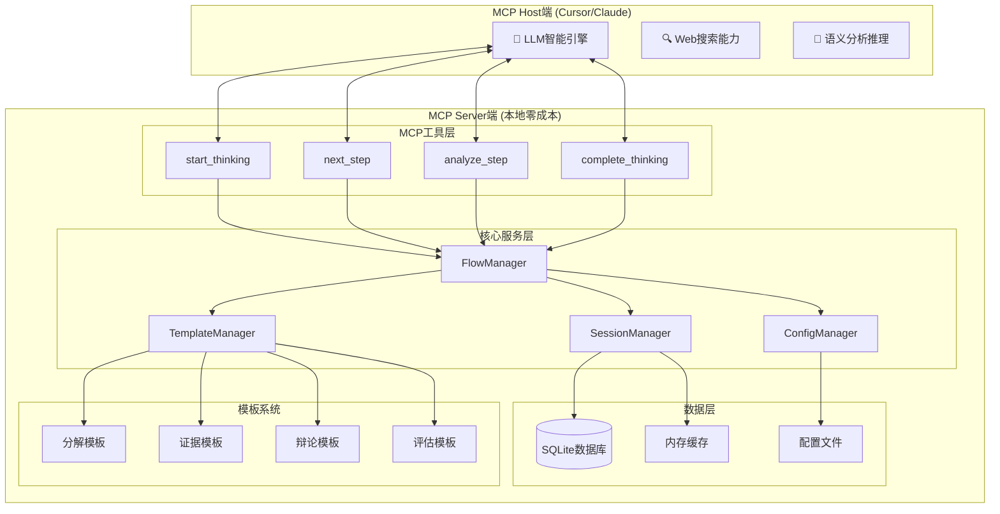

# Deep Thinking Engine - 开发者文档

欢迎来到Deep Thinking Engine的开发者文档！本文档为希望理解、扩展或贡献代码的开发者提供全面的技术指导。

## 项目概览

Deep Thinking Engine是一个基于MCP (Model Context Protocol) 的本地深度思考引擎，采用零成本架构设计，专注于提供系统性的思维方法和批判性思维工具。

### 核心设计原则

1. **智能分工**: MCP Host负责智能生成，MCP Server负责流程编排
2. **零成本运行**: Server端不调用任何LLM API，纯本地处理
3. **模板驱动**: 通过精心设计的Prompt模板引导思维过程
4. **可扩展性**: 支持自定义流程、模板和评估标准
5. **隐私优先**: 所有核心处理在本地进行

### 技术栈

- **Python 3.12+**: 主要开发语言，使用现代类型提示
- **Pydantic 2.0+**: 数据验证和设置管理
- **SQLAlchemy 2.0+**: 数据库ORM，用于会话和数据持久化
- **PyYAML**: 配置管理，用于流程和系统设置
- **Click**: CLI界面框架
- **Rich**: 增强终端输出和格式化
- **Jinja2**: 模板引擎，用于动态Prompt生成
- **MCP SDK**: Model Context Protocol实现

## 架构设计

### 系统架构图



### 模块结构

```
src/mcps/deep_thinking/
├── agents/              # 专门化Agent实现
├── config/              # 配置管理
├── controllers/         # 流程控制和编排
├── data/               # 数据库和持久化
├── flows/              # 流程执行和状态管理
├── models/             # Pydantic数据模型
├── sessions/           # 会话管理
├── templates/          # Prompt模板和验证
├── tools/              # MCP工具和实用程序
├── cli.py              # 命令行界面
└── server.py           # MCP服务器实现
```

## 核心组件详解

### 1. MCP服务器 (server.py)

MCP服务器是系统的入口点，负责处理来自MCP Host的工具调用请求。

```python
class DeepThinkingMCPServer:
    """
    MCP Server for Deep Thinking Engine
    
    提供零成本本地MCP工具，返回Prompt模板供LLM执行
    """
    
    def __init__(self, config_path: Optional[str] = None):
        self.server = Server("deep-thinking-engine")
        self.config_manager = ConfigManager(config_path)
        self.session_manager = SessionManager()
        self.template_manager = TemplateManager()
        self.flow_manager = FlowManager()
        self.mcp_tools = MCPTools(...)
        
        self._register_tools()
    
    def _register_tools(self):
        """注册所有MCP工具"""
        # 注册start_thinking, next_step, analyze_step, complete_thinking
        pass
    
    async def run(self):
        """运行MCP服务器"""
        async with stdio_server() as (read_stream, write_stream):
            await self.server.run(read_stream, write_stream, ...)
```

### 2. MCP工具 (tools/mcp_tools.py)

MCP工具实现核心的思维流程控制逻辑，每个工具都返回Prompt模板而非最终结果。

```python
class MCPTools:
    """
    核心MCP工具，返回Prompt模板供LLM执行
    
    遵循零成本原则：
    - Server处理流程控制和模板管理
    - LLM处理智能处理和内容生成
    """
    
    def start_thinking(self, input_data: StartThinkingInput) -> MCPToolOutput:
        """开始新的深度思考会话"""
        # 1. 创建会话状态
        session_id = str(uuid.uuid4())
        session_state = SessionState(...)
        
        # 2. 保存会话状态
        self.session_manager.create_session(session_state)
        
        # 3. 获取问题分解模板
        template_params = {...}
        prompt_template = self.template_manager.get_template(
            "decomposition", template_params
        )
        
        # 4. 返回模板和指导
        return MCPToolOutput(
            tool_name=MCPToolName.START_THINKING,
            session_id=session_id,
            step="decompose_problem",
            prompt_template=prompt_template,
            instructions="请严格按照JSON格式输出分解结果",
            ...
        )
    
    def next_step(self, input_data: NextStepInput) -> MCPToolOutput:
        """获取思维流程的下一步"""
        # 1. 获取会话状态
        session = self.session_manager.get_session(input_data.session_id)
        
        # 2. 保存上一步结果
        self.session_manager.add_step_result(...)
        
        # 3. 确定下一步
        next_step_info = self._determine_next_step_with_context(...)
        
        # 4. 更新会话状态
        self.session_manager.update_session_step(...)
        
        # 5. 获取相应模板
        prompt_template = self._get_contextual_template(...)
        
        return MCPToolOutput(...)
```

### 3. 会话管理 (sessions/session_manager.py)

会话管理器负责维护思维过程的状态和历史记录。

```python
class SessionManager:
    """会话管理器，处理思维会话的生命周期"""
    
    def __init__(self):
        self.database = Database()
        self.cache = {}  # 内存缓存活跃会话
    
    def create_session(self, session_state: SessionState) -> bool:
        """创建新的思考会话"""
        try:
            # 保存到数据库
            self.database.save_session(session_state)
            # 缓存到内存
            self.cache[session_state.session_id] = session_state
            return True
        except Exception as e:
            logger.error(f"Failed to create session: {e}")
            return False
    
    def get_session(self, session_id: str) -> Optional[SessionState]:
        """获取会话状态"""
        # 先从缓存获取
        if session_id in self.cache:
            return self.cache[session_id]
        
        # 从数据库加载
        session = self.database.load_session(session_id)
        if session:
            self.cache[session_id] = session
        
        return session
    
    def add_step_result(self, session_id: str, step_name: str, 
                       result: str, **kwargs) -> bool:
        """添加步骤执行结果"""
        session = self.get_session(session_id)
        if not session:
            return False
        
        # 更新会话状态
        session.step_results[step_name] = {
            "result": result,
            "timestamp": datetime.now(),
            "metadata": kwargs
        }
        
        # 保存更新
        return self.database.update_session(session)
```

### 4. 模板管理 (templates/template_manager.py)

模板管理器负责加载、缓存和渲染Prompt模板。

```python
class TemplateManager:
    """模板管理器，处理Prompt模板的加载和渲染"""
    
    def __init__(self):
        self.template_cache = {}
        self.jinja_env = Environment(
            loader=FileSystemLoader('templates'),
            autoescape=select_autoescape(['html', 'xml'])
        )
    
    def get_template(self, template_name: str, 
                    params: Dict[str, Any]) -> str:
        """获取渲染后的模板"""
        # 检查缓存
        cache_key = f"{template_name}_{hash(str(params))}"
        if cache_key in self.template_cache:
            return self.template_cache[cache_key]
        
        # 加载模板
        template = self._load_template(template_name)
        if not template:
            raise TemplateNotFoundError(f"Template {template_name} not found")
        
        # 渲染模板
        rendered = template.render(**params)
        
        # 缓存结果
        self.template_cache[cache_key] = rendered
        
        return rendered
    
    def _load_template(self, template_name: str) -> Optional[Template]:
        """加载模板文件"""
        try:
            # 尝试从Python模块加载
            module = importlib.import_module(f"templates.{template_name}_template")
            template_content = getattr(module, f"{template_name.upper()}_TEMPLATE")
            
            return self.jinja_env.from_string(template_content)
        except (ImportError, AttributeError):
            # 尝试从文件加载
            try:
                return self.jinja_env.get_template(f"{template_name}.j2")
            except TemplateNotFound:
                return None
```

### 5. 流程管理 (flows/flow_manager.py)

流程管理器负责定义和控制思维流程的执行顺序。

```python
class FlowManager:
    """流程管理器，控制思维流程的执行"""
    
    def __init__(self):
        self.flows = self._load_flows()
    
    def get_next_step(self, flow_type: str, current_step: str, 
                     step_result: str) -> Optional[Dict[str, Any]]:
        """获取流程中的下一步"""
        flow = self.flows.get(flow_type)
        if not flow:
            return None
        
        current_index = self._find_step_index(flow, current_step)
        if current_index == -1:
            return None
        
        # 检查是否有下一步
        if current_index + 1 >= len(flow['steps']):
            return None  # 流程结束
        
        next_step = flow['steps'][current_index + 1]
        
        # 检查条件执行
        if 'conditional' in next_step:
            if not self._evaluate_condition(next_step['conditional'], step_result):
                # 跳过条件步骤，查找下一个
                return self.get_next_step(flow_type, next_step['step'], step_result)
        
        return {
            "step_name": next_step['step'],
            "template_name": next_step['template'],
            "instructions": next_step.get('instructions', ''),
            "quality_threshold": next_step.get('quality_threshold', 0.7)
        }
    
    def _load_flows(self) -> Dict[str, Any]:
        """从配置文件加载流程定义"""
        with open('config/flows.yaml', 'r', encoding='utf-8') as f:
            config = yaml.safe_load(f)
        return config.get('thinking_flows', {})
```

## 数据模型

### 核心数据模型 (models/)

使用Pydantic定义类型安全的数据模型：

```python
# models/mcp_models.py
class StartThinkingInput(BaseModel):
    """开始思考工具的输入模型"""
    topic: str = Field(..., description="要深度思考的主题或问题")
    complexity: str = Field("moderate", description="问题复杂度级别")
    focus: Optional[str] = Field(None, description="分析重点或特定关注领域")
    flow_type: str = Field("comprehensive_analysis", description="思维流程类型")

class MCPToolOutput(BaseModel):
    """MCP工具输出的统一模型"""
    tool_name: MCPToolName
    session_id: str
    step: str
    prompt_template: str
    instructions: str
    context: Dict[str, Any]
    next_action: str
    metadata: Dict[str, Any] = Field(default_factory=dict)

# models/thinking_models.py
class SessionState(BaseModel):
    """思考会话状态模型"""
    session_id: str
    topic: str
    current_step: str
    flow_type: str
    step_number: int = 0
    status: str = "active"
    context: Dict[str, Any] = Field(default_factory=dict)
    step_results: Dict[str, Any] = Field(default_factory=dict)
    quality_scores: Dict[str, float] = Field(default_factory=dict)
    created_at: datetime = Field(default_factory=datetime.now)
    updated_at: datetime = Field(default_factory=datetime.now)
```

### 数据库模式 (data/database.py)

使用SQLAlchemy定义数据库模式：

```python
class ThinkingSession(Base):
    """思考会话表"""
    __tablename__ = 'thinking_sessions'
    
    id = Column(Integer, primary_key=True)
    session_id = Column(String, unique=True, nullable=False)
    user_id = Column(String)
    topic = Column(Text, nullable=False)
    session_type = Column(String, default='comprehensive_analysis')
    start_time = Column(DateTime, default=datetime.utcnow)
    end_time = Column(DateTime)
    status = Column(String, default='active')
    configuration = Column(JSON)
    final_results = Column(JSON)
    quality_metrics = Column(JSON)

class AgentInteraction(Base):
    """Agent交互记录表"""
    __tablename__ = 'agent_interactions'
    
    id = Column(Integer, primary_key=True)
    session_id = Column(Integer, ForeignKey('thinking_sessions.id'))
    agent_type = Column(String, nullable=False)
    role = Column(String, nullable=False)
    input_data = Column(JSON)
    output_data = Column(JSON)
    execution_time = Column(Float)
    quality_score = Column(Float)
    timestamp = Column(DateTime, default=datetime.utcnow)
```

## 开发环境设置

### 1. 环境准备

```bash
# 克隆项目
git clone <repository-url>
cd mcp-style-agent

# 创建虚拟环境
python -m venv .venv
source .venv/bin/activate  # Linux/macOS
# 或
.venv\Scripts\activate     # Windows

# 安装开发依赖
pip install -e ".[dev]"
# 或使用uv
uv sync --dev
```

### 2. 开发工具配置

**VS Code配置** (`.vscode/settings.json`):
```json
{
    "python.defaultInterpreterPath": "./.venv/bin/python",
    "python.linting.enabled": true,
    "python.linting.pylintEnabled": false,
    "python.linting.flake8Enabled": true,
    "python.formatting.provider": "black",
    "python.sortImports.args": ["--profile", "black"],
    "editor.formatOnSave": true,
    "editor.codeActionsOnSave": {
        "source.organizeImports": true
    }
}
```

**pre-commit配置** (`.pre-commit-config.yaml`):
```yaml
repos:
  - repo: https://github.com/psf/black
    rev: 23.3.0
    hooks:
      - id: black
        language_version: python3.12

  - repo: https://github.com/pycqa/isort
    rev: 5.12.0
    hooks:
      - id: isort
        args: ["--profile", "black"]

  - repo: https://github.com/charliermarsh/ruff-pre-commit
    rev: v0.0.270
    hooks:
      - id: ruff

  - repo: https://github.com/pre-commit/mirrors-mypy
    rev: v1.3.0
    hooks:
      - id: mypy
        additional_dependencies: [pydantic, sqlalchemy]
```

### 3. 开发命令

```bash
# 代码格式化
make format

# 代码检查
make lint

# 运行测试
make test

# 类型检查
make type-check

# 完整检查
make check

# 启动开发服务器
make dev-server
```

## 测试策略

### 1. 单元测试

```python
# tests/test_mcp_tools.py
import pytest
from mcps.deep_thinking.tools.mcp_tools import MCPTools
from mcps.deep_thinking.models.mcp_models import StartThinkingInput

class TestMCPTools:
    def test_start_thinking_tool(self):
        """测试开始思考工具"""
        tools = MCPTools(...)
        input_data = StartThinkingInput(topic="测试问题")
        
        result = tools.start_thinking(input_data)
        
        assert result.tool_name == "start_thinking"
        assert result.session_id is not None
        assert "问题分解" in result.prompt_template
        assert result.step == "decompose_problem"
    
    def test_next_step_tool(self):
        """测试下一步工具"""
        # 创建测试会话
        session_id = self._create_test_session()
        
        input_data = NextStepInput(
            session_id=session_id,
            step_result='{"sub_questions": [...]}'
        )
        
        result = tools.next_step(input_data)
        
        assert result.step == "collect_evidence"
        assert "证据收集" in result.prompt_template
```

### 2. 集成测试

```python
# tests/test_integration.py
class TestIntegration:
    def test_complete_thinking_flow(self):
        """测试完整的思考流程"""
        # 1. 开始思考
        start_result = self.mcp_tools.start_thinking(
            StartThinkingInput(topic="测试问题")
        )
        session_id = start_result.session_id
        
        # 2. 模拟问题分解结果
        decomposition_result = '{"sub_questions": [...]}'
        
        # 3. 获取下一步
        next_result = self.mcp_tools.next_step(
            NextStepInput(
                session_id=session_id,
                step_result=decomposition_result
            )
        )
        
        # 4. 验证流程继续
        assert next_result.step == "collect_evidence"
        
        # 继续测试其他步骤...
```

### 3. 性能测试

```python
# tests/test_performance.py
import time
import pytest

class TestPerformance:
    def test_template_rendering_performance(self):
        """测试模板渲染性能"""
        template_manager = TemplateManager()
        
        start_time = time.time()
        for _ in range(100):
            template_manager.get_template("decomposition", {"topic": "测试"})
        end_time = time.time()
        
        avg_time = (end_time - start_time) / 100
        assert avg_time < 0.01  # 平均渲染时间应小于10ms
    
    def test_session_management_performance(self):
        """测试会话管理性能"""
        session_manager = SessionManager()
        
        # 创建大量会话
        session_ids = []
        start_time = time.time()
        
        for i in range(1000):
            session = SessionState(
                session_id=f"test_{i}",
                topic=f"测试问题{i}",
                current_step="decompose_problem",
                flow_type="comprehensive_analysis"
            )
            session_manager.create_session(session)
            session_ids.append(session.session_id)
        
        creation_time = time.time() - start_time
        
        # 测试检索性能
        start_time = time.time()
        for session_id in session_ids:
            session_manager.get_session(session_id)
        retrieval_time = time.time() - start_time
        
        assert creation_time < 5.0  # 创建1000个会话应在5秒内
        assert retrieval_time < 1.0  # 检索1000个会话应在1秒内
```

## 扩展开发

### 1. 添加新的思维流程

```python
# 1. 定义流程配置 (config/flows.yaml)
custom_analysis:
  name: "自定义分析流程"
  steps:
    - step: "custom_step1"
      template: "custom_template1"
      quality_threshold: 0.7
    - step: "custom_step2"
      template: "custom_template2"
      quality_threshold: 0.8

# 2. 创建模板 (templates/custom_template1.py)
CUSTOM_TEMPLATE1 = """
# 自定义分析步骤1

针对问题：{topic}

请按照以下框架进行分析：
1. 问题背景分析
2. 关键因素识别
3. 影响评估
4. 初步结论

开始分析：
"""

# 3. 注册流程 (flows/flow_manager.py)
def register_custom_flow(self):
    """注册自定义流程"""
    self.flows['custom_analysis'] = self._load_flow_config('custom_analysis')
```

### 2. 添加新的评估标准

```python
# models/evaluation_models.py
class CustomEvaluationCriteria(BaseModel):
    """自定义评估标准"""
    innovation_score: float = Field(..., ge=0, le=10)
    practicality_score: float = Field(..., ge=0, le=10)
    impact_score: float = Field(..., ge=0, le=10)
    
    def calculate_overall_score(self) -> float:
        """计算综合评分"""
        return (self.innovation_score + self.practicality_score + self.impact_score) / 3

# templates/custom_evaluation_template.py
CUSTOM_EVALUATION_TEMPLATE = """
# 自定义评估标准

请基于以下标准评估内容：

## 创新性评估 (1-10分)
- 想法的新颖程度
- 与现有方案的差异化
- 突破性思维的体现

## 实用性评估 (1-10分)
- 实施的可行性
- 资源需求的合理性
- 操作的简便性

## 影响力评估 (1-10分)
- 预期效果的显著性
- 受益范围的广泛性
- 长期价值的持续性

请进行详细评估：
"""
```

### 3. 添加新的MCP工具

```python
# tools/custom_tools.py
class CustomMCPTool:
    """自定义MCP工具"""
    
    def custom_analysis(self, input_data: CustomAnalysisInput) -> MCPToolOutput:
        """自定义分析工具"""
        # 1. 验证输入
        if not input_data.topic:
            raise ValueError("Topic is required")
        
        # 2. 获取模板
        template_params = {
            "topic": input_data.topic,
            "analysis_type": input_data.analysis_type,
            "custom_params": input_data.custom_params
        }
        
        prompt_template = self.template_manager.get_template(
            "custom_analysis", template_params
        )
        
        # 3. 返回结果
        return MCPToolOutput(
            tool_name="custom_analysis",
            session_id=input_data.session_id,
            step="custom_analysis",
            prompt_template=prompt_template,
            instructions="请按照自定义框架进行分析",
            context={"analysis_type": input_data.analysis_type},
            next_action="继续分析或调用其他工具",
            metadata={"custom_tool": True}
        )

# 注册到MCP服务器
@server.list_tools()
async def list_tools() -> List[Tool]:
    return [
        # ... 现有工具
        Tool(
            name="custom_analysis",
            description="执行自定义分析",
            inputSchema={
                "type": "object",
                "properties": {
                    "session_id": {"type": "string"},
                    "topic": {"type": "string"},
                    "analysis_type": {"type": "string"},
                    "custom_params": {"type": "object"}
                },
                "required": ["session_id", "topic", "analysis_type"]
            }
        )
    ]
```

## 性能优化

### 1. 缓存策略

```python
# utils/cache.py
from functools import lru_cache
from typing import Dict, Any
import time

class TemplateCache:
    """模板缓存管理"""
    
    def __init__(self, max_size: int = 100, ttl: int = 3600):
        self.cache: Dict[str, Dict[str, Any]] = {}
        self.max_size = max_size
        self.ttl = ttl
    
    def get(self, key: str) -> Optional[str]:
        """获取缓存内容"""
        if key in self.cache:
            entry = self.cache[key]
            if time.time() - entry['timestamp'] < self.ttl:
                return entry['content']
            else:
                del self.cache[key]
        return None
    
    def set(self, key: str, content: str):
        """设置缓存内容"""
        if len(self.cache) >= self.max_size:
            # 删除最旧的条目
            oldest_key = min(self.cache.keys(), 
                           key=lambda k: self.cache[k]['timestamp'])
            del self.cache[oldest_key]
        
        self.cache[key] = {
            'content': content,
            'timestamp': time.time()
        }

# 使用装饰器缓存
@lru_cache(maxsize=128)
def get_flow_definition(flow_type: str) -> Dict[str, Any]:
    """缓存流程定义"""
    return load_flow_from_config(flow_type)
```

### 2. 数据库优化

```python
# data/database_optimizer.py
class DatabaseOptimizer:
    """数据库性能优化"""
    
    def __init__(self, database: Database):
        self.database = database
    
    def optimize_queries(self):
        """优化查询性能"""
        # 创建索引
        self.database.execute("""
            CREATE INDEX IF NOT EXISTS idx_sessions_user_id 
            ON thinking_sessions(user_id);
        """)
        
        self.database.execute("""
            CREATE INDEX IF NOT EXISTS idx_sessions_status 
            ON thinking_sessions(status);
        """)
        
        self.database.execute("""
            CREATE INDEX IF NOT EXISTS idx_interactions_session_id 
            ON agent_interactions(session_id);
        """)
    
    def cleanup_old_data(self, days: int = 30):
        """清理旧数据"""
        cutoff_date = datetime.now() - timedelta(days=days)
        
        # 删除旧会话
        self.database.execute("""
            DELETE FROM thinking_sessions 
            WHERE start_time < ? AND status = 'completed';
        """, (cutoff_date,))
        
        # 删除孤立的交互记录
        self.database.execute("""
            DELETE FROM agent_interactions 
            WHERE session_id NOT IN (
                SELECT id FROM thinking_sessions
            );
        """)
    
    def analyze_performance(self) -> Dict[str, Any]:
        """分析数据库性能"""
        stats = {}
        
        # 查询统计
        stats['total_sessions'] = self.database.execute(
            "SELECT COUNT(*) FROM thinking_sessions"
        ).fetchone()[0]
        
        stats['active_sessions'] = self.database.execute(
            "SELECT COUNT(*) FROM thinking_sessions WHERE status = 'active'"
        ).fetchone()[0]
        
        # 性能指标
        stats['avg_session_duration'] = self.database.execute("""
            SELECT AVG(
                CASE 
                    WHEN end_time IS NOT NULL 
                    THEN (julianday(end_time) - julianday(start_time)) * 24 * 60
                    ELSE NULL 
                END
            ) FROM thinking_sessions
        """).fetchone()[0]
        
        return stats
```

### 3. 内存管理

```python
# utils/memory_manager.py
import gc
import psutil
from typing import Dict, Any

class MemoryManager:
    """内存管理器"""
    
    def __init__(self, max_memory_mb: int = 512):
        self.max_memory_mb = max_memory_mb
        self.process = psutil.Process()
    
    def get_memory_usage(self) -> Dict[str, float]:
        """获取内存使用情况"""
        memory_info = self.process.memory_info()
        return {
            'rss_mb': memory_info.rss / 1024 / 1024,
            'vms_mb': memory_info.vms / 1024 / 1024,
            'percent': self.process.memory_percent()
        }
    
    def check_memory_limit(self) -> bool:
        """检查是否超过内存限制"""
        usage = self.get_memory_usage()
        return usage['rss_mb'] > self.max_memory_mb
    
    def cleanup_memory(self):
        """清理内存"""
        if self.check_memory_limit():
            # 强制垃圾回收
            gc.collect()
            
            # 清理缓存
            if hasattr(self, 'template_cache'):
                self.template_cache.clear()
            
            # 清理会话缓存
            if hasattr(self, 'session_cache'):
                # 只保留最近的会话
                recent_sessions = dict(
                    sorted(self.session_cache.items(), 
                          key=lambda x: x[1].updated_at, 
                          reverse=True)[:10]
                )
                self.session_cache.clear()
                self.session_cache.update(recent_sessions)
```

## 部署和运维

### 1. 容器化部署

```dockerfile
# 多阶段构建优化
FROM python:3.12-slim as builder

# 安装构建依赖
RUN apt-get update && apt-get install -y \
    build-essential \
    && rm -rf /var/lib/apt/lists/*

# 安装Python依赖
COPY requirements.txt .
RUN pip install --no-cache-dir -r requirements.txt

# 生产阶段
FROM python:3.12-slim as production

# 复制依赖
COPY --from=builder /usr/local/lib/python3.12/site-packages /usr/local/lib/python3.12/site-packages
COPY --from=builder /usr/local/bin /usr/local/bin

# 复制应用代码
COPY src/ /app/src/
COPY config/ /app/config/
COPY templates/ /app/templates/

WORKDIR /app

# 健康检查
HEALTHCHECK --interval=30s --timeout=10s --start-period=5s --retries=3 \
    CMD python -c "from src.mcps.deep_thinking.server import DeepThinkingMCPServer; print('OK')" || exit 1

CMD ["python", "-m", "src.mcps.deep_thinking.server"]
```

### 2. 监控和日志

```python
# utils/monitoring.py
import logging
import time
from functools import wraps
from typing import Callable, Any

class PerformanceMonitor:
    """性能监控器"""
    
    def __init__(self):
        self.metrics = {}
        self.logger = logging.getLogger(__name__)
    
    def track_execution_time(self, func_name: str = None):
        """跟踪函数执行时间"""
        def decorator(func: Callable) -> Callable:
            @wraps(func)
            def wrapper(*args, **kwargs) -> Any:
                start_time = time.time()
                try:
                    result = func(*args, **kwargs)
                    execution_time = time.time() - start_time
                    
                    # 记录指标
                    metric_name = func_name or func.__name__
                    if metric_name not in self.metrics:
                        self.metrics[metric_name] = []
                    self.metrics[metric_name].append(execution_time)
                    
                    # 记录日志
                    self.logger.info(
                        f"{metric_name} executed in {execution_time:.3f}s"
                    )
                    
                    return result
                except Exception as e:
                    execution_time = time.time() - start_time
                    self.logger.error(
                        f"{func_name or func.__name__} failed after {execution_time:.3f}s: {e}"
                    )
                    raise
            return wrapper
        return decorator
    
    def get_performance_report(self) -> Dict[str, Any]:
        """生成性能报告"""
        report = {}
        for func_name, times in self.metrics.items():
            report[func_name] = {
                'count': len(times),
                'avg_time': sum(times) / len(times),
                'min_time': min(times),
                'max_time': max(times),
                'total_time': sum(times)
            }
        return report

# 使用示例
monitor = PerformanceMonitor()

@monitor.track_execution_time("template_rendering")
def render_template(template_name: str, params: Dict[str, Any]) -> str:
    # 模板渲染逻辑
    pass
```

## 贡献指南

### 1. 代码规范

- 使用Black进行代码格式化
- 使用isort整理导入语句
- 使用Ruff进行代码检查
- 使用mypy进行类型检查
- 遵循PEP 8编码规范

### 2. 提交规范

```bash
# 提交消息格式
<type>(<scope>): <description>

# 类型说明
feat: 新功能
fix: 错误修复
docs: 文档更新
style: 代码格式调整
refactor: 代码重构
test: 测试相关
chore: 构建过程或辅助工具的变动

# 示例
feat(templates): add custom evaluation template
fix(session): resolve session timeout issue
docs(api): update MCP tools documentation
```

### 3. Pull Request流程

1. Fork项目到个人仓库
2. 创建功能分支：`git checkout -b feature/new-feature`
3. 提交更改：`git commit -m "feat: add new feature"`
4. 推送分支：`git push origin feature/new-feature`
5. 创建Pull Request
6. 等待代码审查和合并

### 4. 测试要求

- 新功能必须包含单元测试
- 测试覆盖率不低于80%
- 所有测试必须通过
- 性能测试不能有明显退化

## API参考

### MCP工具API

详细的MCP工具API文档请参考：

- [start_thinking API](api/start_thinking.md)
- [next_step API](api/next_step.md)
- [analyze_step API](api/analyze_step.md)
- [complete_thinking API](api/complete_thinking.md)

### 内部API

核心组件的内部API文档：

- [SessionManager API](api/session_manager.md)
- [TemplateManager API](api/template_manager.md)
- [FlowManager API](api/flow_manager.md)
- [ConfigManager API](api/config_manager.md)

## 常见开发问题

### 1. 如何调试MCP工具？

```python
# 启用调试模式
import logging
logging.basicConfig(level=logging.DEBUG)

# 使用调试装饰器
from utils.debug import debug_mcp_tool

@debug_mcp_tool
def start_thinking(self, input_data: StartThinkingInput) -> MCPToolOutput:
    # 工具逻辑
    pass
```

### 2. 如何添加新的模板参数？

```python
# 1. 更新模板定义
TEMPLATE = """
# 新参数: {new_param}
原有内容...
"""

# 2. 更新参数验证
class TemplateParams(BaseModel):
    new_param: str = Field(..., description="新参数描述")

# 3. 更新调用代码
template_params = {
    "new_param": "参数值",
    # 其他参数...
}
```

### 3. 如何优化模板渲染性能？

```python
# 使用模板缓存
@lru_cache(maxsize=128)
def get_compiled_template(template_name: str) -> Template:
    return jinja_env.get_template(f"{template_name}.j2")

# 预编译常用模板
def precompile_templates():
    common_templates = ["decomposition", "evidence_collection", "evaluation"]
    for template_name in common_templates:
        get_compiled_template(template_name)
```

通过这份开发者文档，您应该能够深入理解Deep Thinking Engine的架构设计，并能够有效地进行开发、扩展和维护工作。如果有任何问题，欢迎参与社区讨论或提交Issue。