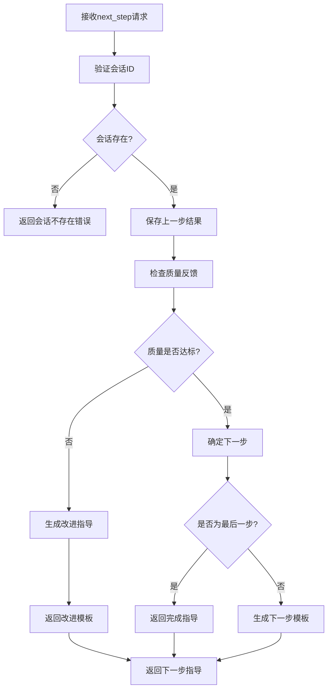

# API接口参考文档

本文档详细描述Deep Thinking Engine的所有API接口，包括MCP工具接口、内部组件接口和扩展接口。

## MCP工具接口

### start_thinking

开始一个新的深度思考会话。

#### 接口定义

```python
def start_thinking(input_data: StartThinkingInput) -> MCPToolOutput
```

#### 输入参数

```python
class StartThinkingInput(BaseModel):
    topic: str = Field(..., description="要深度思考的主题或问题", max_length=1000)
    complexity: str = Field(
        "moderate", 
        description="问题复杂度级别",
        regex="^(simple|moderate|complex)$"
    )
    focus: Optional[str] = Field(
        None, 
        description="分析重点或特定关注领域",
        max_length=200
    )
    flow_type: str = Field(
        "comprehensive_analysis",
        description="思维流程类型",
        regex="^(comprehensive_analysis|quick_analysis|business_analysis|technical_analysis)$"
    )
```

#### 输出格式

```python
class MCPToolOutput(BaseModel):
    tool_name: str = "start_thinking"
    session_id: str  # UUID格式的会话ID
    step: str = "decompose_problem"
    prompt_template: str  # 渲染后的Prompt模板
    instructions: str  # 执行指导
    context: Dict[str, Any]  # 上下文信息
    next_action: str  # 建议的下一步操作
    metadata: Dict[str, Any]  # 元数据
```

#### 使用示例

**基础用法**:
```json
{
  "topic": "如何提高团队协作效率？"
}
```

**高级用法**:
```json
{
  "topic": "如何设计可持续的城市交通系统？",
  "complexity": "complex",
  "focus": "环境影响和技术创新",
  "flow_type": "comprehensive_analysis"
}
```

#### 响应示例

```json
{
  "tool_name": "start_thinking",
  "session_id": "550e8400-e29b-41d4-a716-446655440000",
  "step": "decompose_problem",
  "prompt_template": "# 深度思考：问题分解\n\n你是一位专业的问题分析专家...",
  "instructions": "请严格按照JSON格式输出分解结果，确保包含所有必需字段",
  "context": {
    "topic": "如何设计可持续的城市交通系统？",
    "complexity": "complex",
    "focus": "环境影响和技术创新",
    "session_id": "550e8400-e29b-41d4-a716-446655440000"
  },
  "next_action": "调用next_step工具继续流程",
  "metadata": {
    "flow_type": "comprehensive_analysis",
    "expected_output": "JSON格式的问题分解结果",
    "quality_threshold": 0.7
  }
}
```

#### 错误处理

| 错误类型 | 错误码 | 描述 | 解决方案 |
|---------|--------|------|----------|
| ValidationError | 400 | 输入参数验证失败 | 检查参数格式和取值范围 |
| TemplateNotFoundError | 404 | 模板文件不存在 | 检查模板配置和文件 |
| SessionCreationError | 500 | 会话创建失败 | 检查数据库连接和权限 |

---

### next_step

获取思维流程的下一步指导。

#### 接口定义

```python
def next_step(input_data: NextStepInput) -> MCPToolOutput
```

#### 输入参数

```python
class NextStepInput(BaseModel):
    session_id: str = Field(..., description="思考会话ID", regex="^[0-9a-f-]{36}$")
    step_result: str = Field(..., description="上一步的执行结果", max_length=10000)
    quality_feedback: Optional[Dict[str, Any]] = Field(
        None,
        description="质量反馈信息"
    )

class QualityFeedback(BaseModel):
    quality_score: float = Field(..., ge=0.0, le=1.0, description="质量评分")
    feedback: Optional[str] = Field(None, description="具体反馈内容")
    improvement_areas: Optional[List[str]] = Field(None, description="需要改进的方面")
```

#### 输出格式

```python
class MCPToolOutput(BaseModel):
    tool_name: str = "next_step"
    session_id: str
    step: str  # 下一步的名称
    prompt_template: str  # 下一步的Prompt模板
    instructions: str  # 执行指导
    context: Dict[str, Any]  # 包含会话上下文和历史
    next_action: str  # 建议的下一步操作
    metadata: Dict[str, Any]  # 包含流程进度等信息
```

#### 使用示例

**基础用法**:
```json
{
  "session_id": "550e8400-e29b-41d4-a716-446655440000",
  "step_result": "{\"sub_questions\": [{\"id\": \"1\", \"question\": \"当前城市交通系统的主要问题是什么？\", \"priority\": \"high\"}]}"
}
```

**带质量反馈**:
```json
{
  "session_id": "550e8400-e29b-41d4-a716-446655440000",
  "step_result": "分析结果...",
  "quality_feedback": {
    "quality_score": 0.8,
    "feedback": "分析深度良好，但需要更多具体数据支撑",
    "improvement_areas": ["数据支撑", "量化分析"]
  }
}
```

#### 响应示例

```json
{
  "tool_name": "next_step",
  "session_id": "550e8400-e29b-41d4-a716-446655440000",
  "step": "collect_evidence",
  "prompt_template": "# 深度思考：证据收集\n\n你现在需要为以下子问题收集全面、可靠的证据...",
  "instructions": "针对分解的子问题收集相关证据，确保来源多样化和可信度",
  "context": {
    "session_id": "550e8400-e29b-41d4-a716-446655440000",
    "topic": "如何设计可持续的城市交通系统？",
    "current_step": "collect_evidence",
    "step_number": 2,
    "completed_steps": ["decompose_problem"],
    "previous_results": {
      "decompose_problem": "..."
    }
  },
  "next_action": "执行证据收集后，建议调用analyze_step进行质量检查",
  "metadata": {
    "step_number": 2,
    "flow_progress": "2/7",
    "flow_type": "comprehensive_analysis",
    "previous_step": "decompose_problem",
    "quality_gate_passed": true
  }
}
```

#### 流程控制逻辑



---

### analyze_step

分析步骤执行质量，提供评估和改进建议。

#### 接口定义

```python
def analyze_step(input_data: AnalyzeStepInput) -> MCPToolOutput
```

#### 输入参数

```python
class AnalyzeStepInput(BaseModel):
    session_id: str = Field(..., description="思考会话ID")
    step_name: str = Field(..., description="要分析的步骤名称")
    step_result: str = Field(..., description="步骤执行结果")
    analysis_type: str = Field(
        "quality",
        description="分析类型",
        regex="^(quality|format|completeness|bias|logic)$"
    )
```

#### 输出格式

```python
class MCPToolOutput(BaseModel):
    tool_name: str = "analyze_step"
    session_id: str
    step: str = "analyze_{step_name}"
    prompt_template: str  # 分析评估的Prompt模板
    instructions: str  # 分析指导
    context: Dict[str, Any]  # 分析上下文
    next_action: str  # 基于分析结果的建议
    metadata: Dict[str, Any]  # 分析元数据
```

#### 分析类型说明

| 分析类型 | 描述 | 评估标准 |
|---------|------|----------|
| quality | 综合质量评估 | Paul-Elder九大标准 |
| format | 格式规范检查 | 输出格式要求 |
| completeness | 完整性检查 | 内容覆盖度 |
| bias | 偏见检测 | 认知偏误识别 |
| logic | 逻辑性分析 | 推理链条检查 |

#### 使用示例

```json
{
  "session_id": "550e8400-e29b-41d4-a716-446655440000",
  "step_name": "decompose_problem",
  "step_result": "问题分解结果...",
  "analysis_type": "quality"
}
```

#### 响应示例

```json
{
  "tool_name": "analyze_step",
  "session_id": "550e8400-e29b-41d4-a716-446655440000",
  "step": "analyze_decompose_problem",
  "prompt_template": "# 步骤质量分析\n\n请基于Paul-Elder九大标准评估以下问题分解结果...",
  "instructions": "请对每个评估维度给出1-10分的评分，并提供具体的改进建议",
  "context": {
    "analyzed_step": "decompose_problem",
    "analysis_type": "quality",
    "quality_threshold": 0.7,
    "step_context": "..."
  },
  "next_action": "基于分析结果决定是否需要改进当前步骤或继续下一步",
  "metadata": {
    "quality_check": true,
    "step_analyzed": "decompose_problem",
    "analysis_template": "analyze_decomposition",
    "quality_threshold": 0.7
  }
}
```

---

### complete_thinking

完成思考流程，生成最终综合报告。

#### 接口定义

```python
def complete_thinking(input_data: CompleteThinkingInput) -> MCPToolOutput
```

#### 输入参数

```python
class CompleteThinkingInput(BaseModel):
    session_id: str = Field(..., description="思考会话ID")
    final_insights: Optional[str] = Field(
        None,
        description="最终洞察和总结",
        max_length=2000
    )
```

#### 输出格式

```python
class MCPToolOutput(BaseModel):
    tool_name: str = "complete_thinking"
    session_id: str
    step: str = "generate_final_report"
    prompt_template: str  # 最终报告生成模板
    instructions: str  # 报告生成指导
    context: Dict[str, Any]  # 完整的思考上下文
    next_action: str = "生成最终综合报告，思维流程已完成"
    metadata: Dict[str, Any]  # 会话完成信息
```

#### 使用示例

```json
{
  "session_id": "550e8400-e29b-41d4-a716-446655440000",
  "final_insights": "通过系统性分析，我认为可持续城市交通系统的关键在于..."
}
```

#### 响应示例

```json
{
  "tool_name": "complete_thinking",
  "session_id": "550e8400-e29b-41d4-a716-446655440000",
  "step": "generate_final_report",
  "prompt_template": "# 深度思考总结报告\n\n## 思考主题\n可持续城市交通系统设计\n\n## 请生成综合报告...",
  "instructions": "请基于整个思考过程生成详细的综合报告，包含核心发现、证据支撑、多角度分析等",
  "context": {
    "session_completed": true,
    "total_steps": 7,
    "quality_metrics": {
      "average_quality": 0.85,
      "quality_trend": "improving"
    },
    "session_summary": "...",
    "thinking_trace_available": true
  },
  "next_action": "生成最终综合报告，思维流程已完成",
  "metadata": {
    "session_status": "completed",
    "completion_timestamp": "2024-01-15T10:30:00Z",
    "session_duration_minutes": 45,
    "quality_summary": {
      "average_quality": 0.85,
      "total_steps": 7,
      "high_quality_steps": 6
    }
  }
}
```

## 内部组件接口

### SessionManager

会话管理器负责思考会话的生命周期管理。

#### 核心方法

```python
class SessionManager:
    def create_session(self, session_state: SessionState) -> bool:
        """创建新的思考会话"""
        
    def get_session(self, session_id: str) -> Optional[SessionState]:
        """获取会话状态"""
        
    def update_session(self, session_state: SessionState) -> bool:
        """更新会话状态"""
        
    def add_step_result(self, session_id: str, step_name: str, 
                       result: str, **kwargs) -> bool:
        """添加步骤执行结果"""
        
    def complete_session(self, session_id: str, 
                        final_results: Dict[str, Any]) -> bool:
        """完成会话"""
        
    def get_session_history(self, session_id: str) -> List[Dict[str, Any]]:
        """获取会话历史"""
        
    def cleanup_expired_sessions(self) -> int:
        """清理过期会话"""
```

#### SessionState数据模型

```python
class SessionState(BaseModel):
    session_id: str = Field(..., description="会话唯一标识")
    topic: str = Field(..., description="思考主题")
    current_step: str = Field(..., description="当前步骤")
    flow_type: str = Field(..., description="流程类型")
    step_number: int = Field(0, description="步骤编号")
    status: str = Field("active", description="会话状态")
    context: Dict[str, Any] = Field(default_factory=dict, description="上下文信息")
    step_results: Dict[str, Any] = Field(default_factory=dict, description="步骤结果")
    quality_scores: Dict[str, float] = Field(default_factory=dict, description="质量评分")
    created_at: datetime = Field(default_factory=datetime.now)
    updated_at: datetime = Field(default_factory=datetime.now)
    
    def get_step_duration(self, step_name: str) -> Optional[float]:
        """获取步骤执行时长"""
        
    def get_total_duration(self) -> float:
        """获取总执行时长"""
        
    def get_average_quality(self) -> float:
        """获取平均质量评分"""
```

### TemplateManager

模板管理器负责Prompt模板的加载、缓存和渲染。

#### 核心方法

```python
class TemplateManager:
    def get_template(self, template_name: str, params: Dict[str, Any]) -> str:
        """获取渲染后的模板"""
        
    def register_template(self, template_name: str, template_content: str) -> bool:
        """注册新模板"""
        
    def validate_template(self, template_content: str) -> ValidationResult:
        """验证模板格式"""
        
    def list_templates(self) -> List[str]:
        """列出所有可用模板"""
        
    def reload_templates(self) -> bool:
        """重新加载模板（开发模式）"""
        
    def get_template_metadata(self, template_name: str) -> Dict[str, Any]:
        """获取模板元数据"""
```

#### 模板参数验证

```python
class TemplateParams(BaseModel):
    """模板参数基类"""
    
    class Config:
        extra = "forbid"  # 禁止额外参数

class DecompositionParams(TemplateParams):
    topic: str = Field(..., description="思考主题")
    complexity: str = Field("moderate", description="复杂度")
    focus: Optional[str] = Field(None, description="关注重点")
    domain_context: Optional[str] = Field(None, description="领域背景")

class EvidenceCollectionParams(TemplateParams):
    sub_question: str = Field(..., description="子问题")
    keywords: List[str] = Field(..., description="搜索关键词")
    evidence_types: List[str] = Field(default_factory=list, description="证据类型")
```

### FlowManager

流程管理器负责思维流程的定义和执行控制。

#### 核心方法

```python
class FlowManager:
    def get_flow(self, flow_type: str) -> Optional[ThinkingFlow]:
        """获取思维流程定义"""
        
    def get_next_step(self, flow_type: str, current_step: str, 
                     step_result: str, context: Dict[str, Any]) -> Optional[FlowStep]:
        """获取下一步"""
        
    def validate_flow(self, flow_definition: Dict[str, Any]) -> ValidationResult:
        """验证流程定义"""
        
    def register_flow(self, flow_type: str, flow_definition: Dict[str, Any]) -> bool:
        """注册新流程"""
        
    def get_flow_progress(self, flow_type: str, current_step: str) -> Dict[str, Any]:
        """获取流程进度"""
```

#### 流程定义模型

```python
class ThinkingFlow(BaseModel):
    name: str = Field(..., description="流程名称")
    description: str = Field(..., description="流程描述")
    steps: List[FlowStepConfig] = Field(..., description="流程步骤")
    metadata: Dict[str, Any] = Field(default_factory=dict)

class FlowStepConfig(BaseModel):
    step: str = Field(..., description="步骤名称")
    name: str = Field(..., description="步骤显示名称")
    template: str = Field(..., description="模板名称")
    required: bool = Field(True, description="是否必需")
    quality_threshold: float = Field(0.7, description="质量门槛")
    conditional: Optional[str] = Field(None, description="条件表达式")
    depends_on: List[str] = Field(default_factory=list, description="依赖步骤")
    parallel: bool = Field(False, description="是否可并行")
    retry_on_failure: bool = Field(False, description="失败时是否重试")
    metadata: Dict[str, Any] = Field(default_factory=dict)
```

### ConfigManager

配置管理器负责系统配置的加载和管理。

#### 核心方法

```python
class ConfigManager:
    def __init__(self, config_path: Optional[str] = None):
        """初始化配置管理器"""
        
    def get(self, key: str, default: Any = None) -> Any:
        """获取配置值"""
        
    def set(self, key: str, value: Any) -> bool:
        """设置配置值"""
        
    def reload_config(self) -> bool:
        """重新加载配置"""
        
    def validate_config(self) -> ValidationResult:
        """验证配置有效性"""
        
    def get_config_schema(self) -> Dict[str, Any]:
        """获取配置模式"""
```

#### 配置结构

```python
class SystemConfig(BaseModel):
    server: ServerConfig
    database: DatabaseConfig
    templates: TemplateConfig
    flows: FlowConfig
    logging: LoggingConfig
    development: DevelopmentConfig

class ServerConfig(BaseModel):
    name: str = "deep-thinking-engine"
    version: str = "0.1.0"
    runtime: RuntimeConfig
    performance: PerformanceConfig
    security: SecurityConfig

class RuntimeConfig(BaseModel):
    log_level: str = "INFO"
    max_sessions: int = 100
    session_timeout_minutes: int = 60
    enable_debug: bool = False
```

## 扩展接口

### 插件系统

#### Plugin基类

```python
class Plugin(ABC):
    """插件抽象基类"""
    
    @property
    @abstractmethod
    def name(self) -> str:
        """插件名称"""
        pass
    
    @property
    @abstractmethod
    def version(self) -> str:
        """插件版本"""
        pass
    
    @abstractmethod
    def initialize(self, config: Dict[str, Any]) -> bool:
        """初始化插件"""
        pass
    
    @abstractmethod
    def get_hooks(self) -> Dict[str, Callable]:
        """获取钩子函数"""
        pass
    
    def cleanup(self) -> bool:
        """清理资源"""
        return True
```

#### 钩子系统

```python
class HookManager:
    """钩子管理器"""
    
    def register_hook(self, hook_name: str, callback: Callable, priority: int = 0):
        """注册钩子"""
        
    def call_hook(self, hook_name: str, *args, **kwargs) -> List[Any]:
        """调用钩子"""
        
    def remove_hook(self, hook_name: str, callback: Callable):
        """移除钩子"""

# 可用钩子点
AVAILABLE_HOOKS = {
    "before_session_create": "会话创建前",
    "after_session_create": "会话创建后",
    "before_step_execute": "步骤执行前",
    "after_step_execute": "步骤执行后",
    "before_template_render": "模板渲染前",
    "after_template_render": "模板渲染后",
    "on_quality_check": "质量检查时",
    "on_session_complete": "会话完成时"
}
```

### 自定义模板接口

#### 模板基类

```python
class BaseTemplate(ABC):
    """模板基类"""
    
    @property
    @abstractmethod
    def name(self) -> str:
        """模板名称"""
        pass
    
    @property
    @abstractmethod
    def description(self) -> str:
        """模板描述"""
        pass
    
    @abstractmethod
    def get_required_params(self) -> List[str]:
        """获取必需参数"""
        pass
    
    @abstractmethod
    def render(self, **params) -> str:
        """渲染模板"""
        pass
    
    def validate_params(self, params: Dict[str, Any]) -> ValidationResult:
        """验证参数"""
        required = self.get_required_params()
        missing = [p for p in required if p not in params]
        
        if missing:
            return ValidationResult(False, f"Missing required parameters: {missing}")
        
        return ValidationResult(True)
```

#### 自定义模板示例

```python
class CustomAnalysisTemplate(BaseTemplate):
    """自定义分析模板"""
    
    @property
    def name(self) -> str:
        return "custom_analysis"
    
    @property
    def description(self) -> str:
        return "自定义分析模板，适用于特定领域分析"
    
    def get_required_params(self) -> List[str]:
        return ["topic", "domain", "analysis_framework"]
    
    def render(self, **params) -> str:
        return f"""
# 自定义领域分析：{params['topic']}

## 分析领域
{params['domain']}

## 分析框架
{params['analysis_framework']}

## 分析要求
请基于{params['domain']}领域的专业知识，
使用{params['analysis_framework']}框架进行系统性分析。

开始分析：
"""
```

### 评估器接口

#### 评估器基类

```python
class BaseEvaluator(ABC):
    """评估器基类"""
    
    @property
    @abstractmethod
    def name(self) -> str:
        """评估器名称"""
        pass
    
    @abstractmethod
    def evaluate(self, content: str, context: Dict[str, Any]) -> EvaluationResult:
        """执行评估"""
        pass
    
    @abstractmethod
    def get_criteria(self) -> List[str]:
        """获取评估标准"""
        pass

class EvaluationResult(BaseModel):
    """评估结果"""
    overall_score: float = Field(..., ge=0.0, le=1.0)
    criteria_scores: Dict[str, float] = Field(...)
    strengths: List[str] = Field(default_factory=list)
    weaknesses: List[str] = Field(default_factory=list)
    suggestions: List[str] = Field(default_factory=list)
    passed_quality_gate: bool = Field(...)
```

#### 自定义评估器示例

```python
class DomainSpecificEvaluator(BaseEvaluator):
    """领域特定评估器"""
    
    def __init__(self, domain: str, criteria: Dict[str, float]):
        self.domain = domain
        self.criteria_weights = criteria
    
    @property
    def name(self) -> str:
        return f"{self.domain}_evaluator"
    
    def evaluate(self, content: str, context: Dict[str, Any]) -> EvaluationResult:
        scores = {}
        
        # 实现领域特定的评估逻辑
        for criterion, weight in self.criteria_weights.items():
            score = self._evaluate_criterion(content, criterion)
            scores[criterion] = score
        
        overall_score = sum(
            score * weight for score, weight in 
            zip(scores.values(), self.criteria_weights.values())
        )
        
        return EvaluationResult(
            overall_score=overall_score,
            criteria_scores=scores,
            strengths=self._identify_strengths(scores),
            weaknesses=self._identify_weaknesses(scores),
            suggestions=self._generate_suggestions(scores),
            passed_quality_gate=overall_score >= 0.7
        )
    
    def get_criteria(self) -> List[str]:
        return list(self.criteria_weights.keys())
```

## 错误处理

### 异常层次结构

```python
class DeepThinkingError(Exception):
    """基础异常类"""
    
    def __init__(self, message: str, error_code: str = None, details: Dict[str, Any] = None):
        super().__init__(message)
        self.message = message
        self.error_code = error_code or self.__class__.__name__
        self.details = details or {}
        self.timestamp = datetime.now()

class ValidationError(DeepThinkingError):
    """输入验证错误"""
    pass

class SessionNotFoundError(DeepThinkingError):
    """会话不存在错误"""
    pass

class TemplateNotFoundError(DeepThinkingError):
    """模板不存在错误"""
    pass

class FlowExecutionError(DeepThinkingError):
    """流程执行错误"""
    pass

class QualityGateError(DeepThinkingError):
    """质量门槛错误"""
    pass
```

### 错误响应格式

```python
class ErrorResponse(BaseModel):
    """错误响应格式"""
    error: bool = True
    error_code: str
    error_message: str
    details: Dict[str, Any] = Field(default_factory=dict)
    timestamp: datetime = Field(default_factory=datetime.now)
    recovery_suggestions: List[str] = Field(default_factory=list)
    
    @classmethod
    def from_exception(cls, exc: DeepThinkingError) -> "ErrorResponse":
        """从异常创建错误响应"""
        return cls(
            error_code=exc.error_code,
            error_message=exc.message,
            details=exc.details,
            timestamp=exc.timestamp,
            recovery_suggestions=cls._get_recovery_suggestions(exc)
        )
    
    @staticmethod
    def _get_recovery_suggestions(exc: DeepThinkingError) -> List[str]:
        """获取恢复建议"""
        suggestions = {
            "ValidationError": [
                "检查输入参数的格式和取值范围",
                "参考API文档确认参数要求"
            ],
            "SessionNotFoundError": [
                "确认会话ID是否正确",
                "检查会话是否已过期",
                "重新开始思考流程"
            ],
            "TemplateNotFoundError": [
                "检查模板文件是否存在",
                "验证模板配置是否正确",
                "重启服务器重新加载模板"
            ]
        }
        
        return suggestions.get(exc.error_code, ["联系技术支持获取帮助"])
```

## 性能指标

### 响应时间要求

| 接口 | 目标响应时间 | 最大响应时间 |
|------|-------------|-------------|
| start_thinking | < 100ms | < 500ms |
| next_step | < 200ms | < 1s |
| analyze_step | < 300ms | < 1.5s |
| complete_thinking | < 500ms | < 2s |

### 吞吐量要求

- 并发会话数：最大100个
- 每秒请求数：最大50个
- 模板渲染：每秒1000次

### 资源使用限制

- 内存使用：最大512MB
- CPU使用：最大50%
- 磁盘空间：最大1GB

## 版本兼容性

### API版本控制

```python
class APIVersion(BaseModel):
    major: int
    minor: int
    patch: int
    
    def __str__(self) -> str:
        return f"{self.major}.{self.minor}.{self.patch}"
    
    def is_compatible(self, other: "APIVersion") -> bool:
        """检查版本兼容性"""
        return self.major == other.major

# 当前API版本
CURRENT_API_VERSION = APIVersion(major=1, minor=0, patch=0)
```

### 向后兼容性保证

- 主版本号相同的API保证向后兼容
- 新增字段使用可选参数
- 废弃功能提供至少一个版本的过渡期
- 重大变更通过主版本号升级

## 使用最佳实践

### 1. 错误处理

```python
try:
    result = mcp_tools.start_thinking(input_data)
    # 处理成功结果
except ValidationError as e:
    # 处理输入验证错误
    logger.error(f"Input validation failed: {e}")
    return error_response(e)
except SessionCreationError as e:
    # 处理会话创建错误
    logger.error(f"Session creation failed: {e}")
    return error_response(e)
except Exception as e:
    # 处理未预期错误
    logger.error(f"Unexpected error: {e}")
    return error_response(DeepThinkingError("Internal server error"))
```

### 2. 性能优化

```python
# 使用缓存减少重复计算
@lru_cache(maxsize=128)
def get_template_cached(template_name: str, params_hash: str) -> str:
    return template_manager.get_template(template_name, params)

# 异步处理长时间操作
async def process_thinking_session(session_id: str):
    session = await session_manager.get_session_async(session_id)
    # 异步处理逻辑
```

### 3. 监控和日志

```python
# 添加性能监控
@performance_monitor
def start_thinking(input_data: StartThinkingInput) -> MCPToolOutput:
    # 实现逻辑
    pass

# 结构化日志
logger.info("Session created", extra={
    "session_id": session.session_id,
    "topic": session.topic,
    "flow_type": session.flow_type
})
```

通过这份详细的API参考文档，开发者可以准确理解和使用Deep Thinking Engine的各种接口，实现高质量的集成和扩展开发。