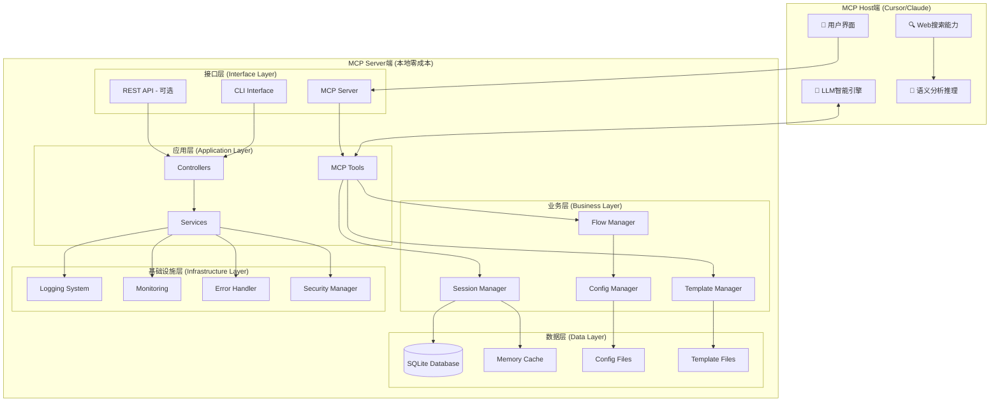
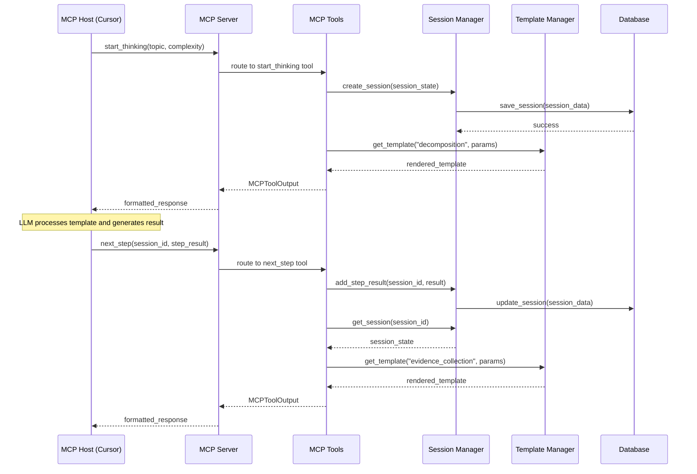
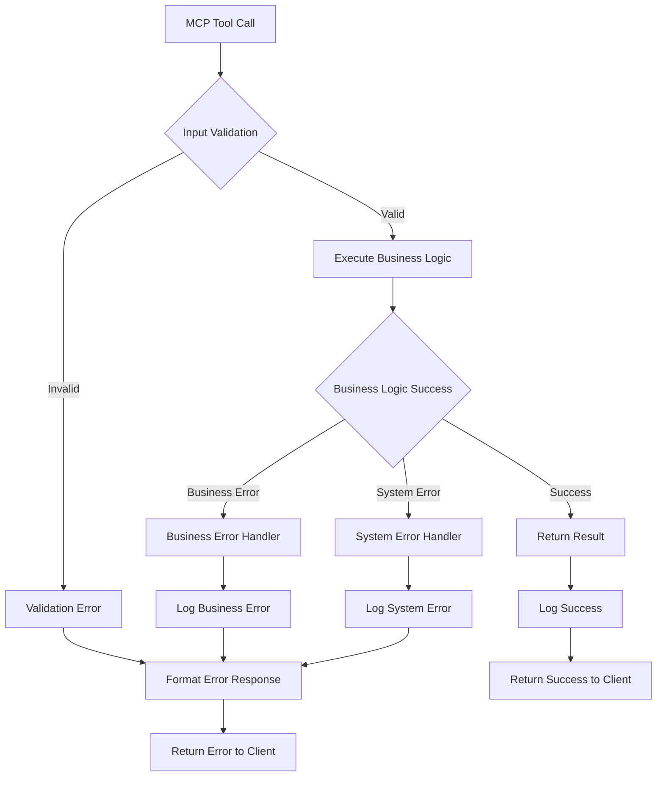

# 系统架构设计文档

本文档详细描述Deep Thinking Engine的系统架构设计，包括核心组件、数据流、设计模式和技术决策。

## 架构概览

Deep Thinking Engine采用分层架构设计，遵循"智能分工"原则，将系统分为MCP Host端和MCP Server端两个主要部分。

### 整体架构图



## 核心设计原则

### 1. 智能分工原则 (Intelligent Division of Labor)

**MCP Host端职责**:
- 🧠 **智能生成**: 基于Prompt模板生成高质量内容
- 🔍 **信息检索**: 利用内置Web搜索获取外部信息
- 💭 **语义推理**: 执行复杂的逻辑推理和分析
- 📝 **内容创作**: 生成论证、反驳、创新想法等

**MCP Server端职责**:
- 🔧 **流程编排**: 管理深度思考的步骤序列
- 📋 **状态维护**: 跟踪思维过程的当前状态
- 📄 **模板管理**: 提供精心设计的Prompt模板
- 💾 **数据持久化**: 维护会话状态和历史记录

### 2. 零成本运行原则 (Zero-Cost Operation)

```python
# MCP Server端严格遵循零API调用原则
class MCPTools:
    def start_thinking(self, input_data: StartThinkingInput) -> MCPToolOutput:
        """
        返回Prompt模板而非最终结果
        零LLM API调用，纯本地处理
        """
        # ✅ 本地状态管理
        session_id = self._create_session(input_data.topic)
        
        # ✅ 本地模板渲染
        prompt_template = self.template_manager.get_template(
            "decomposition", {"topic": input_data.topic}
        )
        
        # ✅ 返回模板供Host端LLM处理
        return MCPToolOutput(
            prompt_template=prompt_template,
            instructions="请按照模板执行问题分解",
            # ❌ 不进行任何LLM调用
        )
```

### 3. 模板驱动架构 (Template-Driven Architecture)

系统的核心逻辑通过Prompt模板来实现，将科学的思维方法编码为可执行的模板：

```python
# 模板驱动的思维方法实现
PAUL_ELDER_EVALUATION_TEMPLATE = """
# 批判性思维评估 (Paul-Elder标准)

请基于以下九大标准评估内容：

## 1. 准确性 (Accuracy)
- 信息是否准确无误？
- 有无事实错误？
- 评分：___/10分，理由：

## 2. 精确性 (Precision)
- 表述是否具体明确？
- 有无模糊不清之处？
- 评分：___/10分，理由：

[... 其他7个标准]

## 综合评估
- 总分：___/90分
- 质量等级：优秀/良好/一般/较差
- 改进建议：
"""
```

## 分层架构详解

### 接口层 (Interface Layer)

接口层负责处理外部请求和响应，提供多种访问方式。

#### MCP Server接口

```python
class DeepThinkingMCPServer:
    """
    标准MCP协议服务器实现
    处理来自MCP Host的工具调用请求
    """
    
    async def handle_tool_call(self, name: str, arguments: Dict[str, Any]) -> List[TextContent]:
        """处理MCP工具调用"""
        try:
            # 路由到相应的工具处理器
            if name == "start_thinking":
                result = await self.mcp_tools.start_thinking(StartThinkingInput(**arguments))
            elif name == "next_step":
                result = await self.mcp_tools.next_step(NextStepInput(**arguments))
            # ... 其他工具
            
            # 格式化响应
            return [TextContent(type="text", text=self._format_response(result))]
            
        except Exception as e:
            return [TextContent(type="text", text=self._format_error(e))]
```

#### CLI接口

```python
@click.group()
def cli():
    """Deep Thinking Engine命令行界面"""
    pass

@cli.command()
@click.argument("question")
@click.option("--complexity", type=click.Choice(["simple", "moderate", "complex"]))
def think(question: str, complexity: str = "moderate"):
    """开始深度思考会话"""
    # 直接调用业务层服务
    service = ThinkingService()
    result = service.start_thinking(question, complexity)
    console.print(result)
```

### 应用层 (Application Layer)

应用层包含MCP工具和控制器，负责处理业务逻辑和协调各个组件。

#### MCP工具实现

```python
class MCPTools:
    """
    MCP工具集合，实现核心的思维流程控制
    每个工具都遵循"返回模板，不执行推理"的原则
    """
    
    def __init__(self, session_manager, template_manager, flow_manager):
        self.session_manager = session_manager
        self.template_manager = template_manager
        self.flow_manager = flow_manager
        self.error_handler = MCPErrorHandler()
    
    @error_handling
    @performance_monitoring
    def start_thinking(self, input_data: StartThinkingInput) -> MCPToolOutput:
        """开始深度思考流程"""
        # 1. 创建会话
        session = self._create_session(input_data)
        
        # 2. 获取初始模板
        template = self._get_initial_template(input_data)
        
        # 3. 构建响应
        return MCPToolOutput(
            tool_name="start_thinking",
            session_id=session.session_id,
            step="decompose_problem",
            prompt_template=template,
            instructions=self._generate_instructions(input_data),
            context=self._build_context(session),
            next_action="调用next_step工具继续流程",
            metadata=self._build_metadata(session)
        )
    
    def _create_session(self, input_data: StartThinkingInput) -> SessionState:
        """创建新的思考会话"""
        session = SessionState(
            session_id=str(uuid.uuid4()),
            topic=input_data.topic,
            current_step="decompose_problem",
            flow_type=input_data.flow_type,
            context={
                "complexity": input_data.complexity,
                "focus": input_data.focus,
                "created_at": datetime.now().isoformat()
            }
        )
        
        # 保存到会话管理器
        self.session_manager.create_session(session)
        return session
```

#### 控制器层

```python
class ThinkingController:
    """思维流程控制器"""
    
    def __init__(self):
        self.thinking_service = ThinkingService()
        self.validation_service = ValidationService()
    
    async def start_thinking_session(self, request: StartThinkingRequest) -> ThinkingResponse:
        """启动思考会话的控制器方法"""
        # 1. 输入验证
        validation_result = await self.validation_service.validate_input(request)
        if not validation_result.is_valid:
            raise ValidationError(validation_result.errors)
        
        # 2. 业务逻辑处理
        result = await self.thinking_service.start_thinking(
            topic=request.topic,
            complexity=request.complexity,
            flow_type=request.flow_type
        )
        
        # 3. 响应格式化
        return ThinkingResponse(
            session_id=result.session_id,
            prompt_template=result.prompt_template,
            instructions=result.instructions,
            status="started"
        )
```

### 业务层 (Business Layer)

业务层包含核心的业务逻辑组件，负责实现深度思考的各种功能。

#### 流程管理器 (Flow Manager)

```python
class FlowManager:
    """
    思维流程管理器
    负责定义、加载和执行思维流程
    """
    
    def __init__(self, config_manager: ConfigManager):
        self.config_manager = config_manager
        self.flows = self._load_flows()
        self.flow_cache = {}
    
    def get_next_step(self, flow_type: str, current_step: str, 
                     step_result: str, context: Dict[str, Any]) -> Optional[FlowStep]:
        """获取流程中的下一步"""
        flow = self._get_flow(flow_type)
        if not flow:
            raise FlowNotFoundError(f"Flow {flow_type} not found")
        
        current_index = self._find_step_index(flow, current_step)
        if current_index == -1:
            raise StepNotFoundError(f"Step {current_step} not found in flow {flow_type}")
        
        # 检查是否有下一步
        if current_index + 1 >= len(flow.steps):
            return None  # 流程结束
        
        next_step_config = flow.steps[current_index + 1]
        
        # 检查条件执行
        if next_step_config.conditional:
            if not self._evaluate_condition(next_step_config.conditional, step_result, context):
                # 递归查找下一个符合条件的步骤
                return self.get_next_step(flow_type, next_step_config.name, step_result, context)
        
        # 检查质量门槛
        if next_step_config.quality_gate:
            quality_score = self._extract_quality_score(step_result)
            if quality_score < next_step_config.quality_threshold:
                return self._create_improvement_step(current_step, quality_score)
        
        return FlowStep(
            name=next_step_config.name,
            template_name=next_step_config.template,
            instructions=next_step_config.instructions,
            quality_threshold=next_step_config.quality_threshold,
            metadata=next_step_config.metadata
        )
    
    def _evaluate_condition(self, condition: str, step_result: str, 
                          context: Dict[str, Any]) -> bool:
        """评估条件表达式"""
        # 安全的条件评估
        safe_globals = {
            "complexity": context.get("complexity"),
            "quality_score": self._extract_quality_score(step_result),
            "step_count": context.get("step_count", 0),
            # 其他安全的变量
        }
        
        try:
            return eval(condition, {"__builtins__": {}}, safe_globals)
        except Exception as e:
            logger.warning(f"Condition evaluation failed: {condition}, error: {e}")
            return True  # 默认执行
```

#### 会话管理器 (Session Manager)

```python
class SessionManager:
    """
    会话管理器
    负责会话的创建、更新、查询和生命周期管理
    """
    
    def __init__(self, database: Database, cache: Cache):
        self.database = database
        self.cache = cache
        self.session_timeout = timedelta(hours=1)
    
    def create_session(self, session_state: SessionState) -> bool:
        """创建新的思考会话"""
        try:
            # 验证会话数据
            self._validate_session_state(session_state)
            
            # 保存到数据库
            self.database.save_session(session_state)
            
            # 缓存到内存
            self.cache.set(session_state.session_id, session_state, ttl=3600)
            
            # 记录创建事件
            self._log_session_event(session_state.session_id, "created")
            
            return True
            
        except Exception as e:
            logger.error(f"Failed to create session {session_state.session_id}: {e}")
            return False
    
    def get_session(self, session_id: str) -> Optional[SessionState]:
        """获取会话状态"""
        # 1. 从缓存获取
        session = self.cache.get(session_id)
        if session:
            # 检查是否过期
            if self._is_session_expired(session):
                self._expire_session(session_id)
                return None
            return session
        
        # 2. 从数据库加载
        session = self.database.load_session(session_id)
        if session:
            # 检查是否过期
            if self._is_session_expired(session):
                self._expire_session(session_id)
                return None
            
            # 缓存到内存
            self.cache.set(session_id, session, ttl=3600)
            return session
        
        return None
    
    def add_step_result(self, session_id: str, step_name: str, 
                       result: str, **kwargs) -> bool:
        """添加步骤执行结果"""
        session = self.get_session(session_id)
        if not session:
            raise SessionNotFoundError(f"Session {session_id} not found")
        
        # 更新会话状态
        step_data = {
            "result": result,
            "timestamp": datetime.now(),
            "quality_score": kwargs.get("quality_score"),
            "metadata": kwargs.get("metadata", {}),
            "execution_time": kwargs.get("execution_time")
        }
        
        session.step_results[step_name] = step_data
        session.step_number += 1
        session.updated_at = datetime.now()
        
        # 更新质量评分历史
        if kwargs.get("quality_score"):
            session.quality_scores[step_name] = kwargs["quality_score"]
        
        # 保存更新
        success = self.database.update_session(session)
        if success:
            # 更新缓存
            self.cache.set(session_id, session, ttl=3600)
            self._log_session_event(session_id, "step_completed", {"step": step_name})
        
        return success
    
    def _is_session_expired(self, session: SessionState) -> bool:
        """检查会话是否过期"""
        if session.status == "completed":
            return False
        
        time_since_update = datetime.now() - session.updated_at
        return time_since_update > self.session_timeout
```

#### 模板管理器 (Template Manager)

```python
class TemplateManager:
    """
    模板管理器
    负责Prompt模板的加载、缓存、渲染和验证
    """
    
    def __init__(self, config_manager: ConfigManager):
        self.config_manager = config_manager
        self.template_cache = LRUCache(maxsize=100)
        self.jinja_env = self._setup_jinja_environment()
        self.template_validator = TemplateValidator()
    
    def get_template(self, template_name: str, params: Dict[str, Any]) -> str:
        """获取渲染后的模板"""
        # 1. 参数验证
        validated_params = self._validate_parameters(template_name, params)
        
        # 2. 检查缓存
        cache_key = self._generate_cache_key(template_name, validated_params)
        cached_template = self.template_cache.get(cache_key)
        if cached_template:
            return cached_template
        
        # 3. 加载模板
        template = self._load_template(template_name)
        if not template:
            raise TemplateNotFoundError(f"Template {template_name} not found")
        
        # 4. 渲染模板
        try:
            rendered = template.render(**validated_params)
            
            # 5. 验证渲染结果
            if not self.template_validator.validate_rendered_template(rendered):
                raise TemplateRenderError(f"Template {template_name} rendered invalid content")
            
            # 6. 缓存结果
            self.template_cache[cache_key] = rendered
            
            return rendered
            
        except Exception as e:
            logger.error(f"Template rendering failed for {template_name}: {e}")
            raise TemplateRenderError(f"Failed to render template {template_name}: {e}")
    
    def _load_template(self, template_name: str) -> Optional[Template]:
        """加载模板文件"""
        # 1. 尝试从Python模块加载
        try:
            module_name = f"templates.{template_name}_template"
            module = importlib.import_module(module_name)
            template_content = getattr(module, f"{template_name.upper()}_TEMPLATE")
            
            # 验证模板内容
            if self.template_validator.validate_template_content(template_content):
                return self.jinja_env.from_string(template_content)
            else:
                logger.warning(f"Template {template_name} failed validation")
                
        except (ImportError, AttributeError) as e:
            logger.debug(f"Failed to load template from module {template_name}: {e}")
        
        # 2. 尝试从文件加载
        try:
            template_file = f"{template_name}.j2"
            template = self.jinja_env.get_template(template_file)
            
            # 验证模板文件
            if self.template_validator.validate_template_file(template_file):
                return template
            else:
                logger.warning(f"Template file {template_file} failed validation")
                
        except TemplateNotFound as e:
            logger.debug(f"Template file not found: {template_file}")
        
        return None
    
    def _setup_jinja_environment(self) -> Environment:
        """设置Jinja2环境"""
        env = Environment(
            loader=FileSystemLoader(['templates', 'templates/custom']),
            autoescape=select_autoescape(['html', 'xml']),
            trim_blocks=True,
            lstrip_blocks=True
        )
        
        # 添加自定义过滤器
        env.filters['format_list'] = self._format_list_filter
        env.filters['truncate_text'] = self._truncate_text_filter
        env.filters['highlight_keywords'] = self._highlight_keywords_filter
        
        # 添加自定义函数
        env.globals['current_time'] = datetime.now
        env.globals['format_duration'] = self._format_duration
        
        return env
    
    def reload_templates(self):
        """重新加载所有模板（开发模式）"""
        if self.config_manager.get('development.enable_hot_reload'):
            self.template_cache.clear()
            self.jinja_env = self._setup_jinja_environment()
            logger.info("Templates reloaded")
```

### 数据层 (Data Layer)

数据层负责数据的持久化存储和缓存管理。

#### 数据库设计

```sql
-- 思考会话表
CREATE TABLE thinking_sessions (
    id INTEGER PRIMARY KEY AUTOINCREMENT,
    session_id TEXT UNIQUE NOT NULL,
    user_id TEXT,
    topic TEXT NOT NULL,
    session_type TEXT DEFAULT 'comprehensive_analysis',
    start_time TIMESTAMP DEFAULT CURRENT_TIMESTAMP,
    end_time TIMESTAMP,
    status TEXT DEFAULT 'active',
    configuration JSON,
    final_results JSON,
    quality_metrics JSON,
    created_at TIMESTAMP DEFAULT CURRENT_TIMESTAMP,
    updated_at TIMESTAMP DEFAULT CURRENT_TIMESTAMP
);

-- Agent交互记录表
CREATE TABLE agent_interactions (
    id INTEGER PRIMARY KEY AUTOINCREMENT,
    session_id INTEGER REFERENCES thinking_sessions(id),
    step_name TEXT NOT NULL,
    agent_type TEXT NOT NULL,
    role TEXT NOT NULL,
    input_data JSON,
    output_data JSON,
    execution_time REAL,
    quality_score REAL,
    timestamp TIMESTAMP DEFAULT CURRENT_TIMESTAMP,
    parent_interaction_id INTEGER REFERENCES agent_interactions(id)
);

-- 证据来源表
CREATE TABLE evidence_sources (
    id INTEGER PRIMARY KEY AUTOINCREMENT,
    session_id INTEGER REFERENCES thinking_sessions(id),
    url TEXT,
    title TEXT,
    summary TEXT,
    credibility_score REAL,
    source_type TEXT,
    publication_date TEXT,
    key_claims JSON,
    citation_count INTEGER DEFAULT 0,
    created_at TIMESTAMP DEFAULT CURRENT_TIMESTAMP
);

-- 思维轨迹表
CREATE TABLE thinking_traces (
    id INTEGER PRIMARY KEY AUTOINCREMENT,
    session_id INTEGER REFERENCES thinking_sessions(id),
    step_number INTEGER,
    step_name TEXT,
    thought_content TEXT,
    evidence_references JSON,
    evaluation_scores JSON,
    bias_flags JSON,
    timestamp TIMESTAMP DEFAULT CURRENT_TIMESTAMP
);

-- 索引优化
CREATE INDEX idx_sessions_user_id ON thinking_sessions(user_id);
CREATE INDEX idx_sessions_status ON thinking_sessions(status);
CREATE INDEX idx_sessions_created_at ON thinking_sessions(created_at);
CREATE INDEX idx_interactions_session_id ON agent_interactions(session_id);
CREATE INDEX idx_interactions_timestamp ON agent_interactions(timestamp);
CREATE INDEX idx_evidence_session_id ON evidence_sources(session_id);
CREATE INDEX idx_traces_session_id ON thinking_traces(session_id);
```

#### 数据访问层

```python
class Database:
    """数据库访问层"""
    
    def __init__(self, db_path: str):
        self.db_path = db_path
        self.engine = create_engine(f"sqlite:///{db_path}")
        self.session_factory = sessionmaker(bind=self.engine)
        self._create_tables()
    
    def save_session(self, session_state: SessionState) -> bool:
        """保存会话状态到数据库"""
        try:
            with self.session_factory() as db_session:
                db_session.add(ThinkingSession(
                    session_id=session_state.session_id,
                    topic=session_state.topic,
                    session_type=session_state.flow_type,
                    status=session_state.status,
                    configuration=session_state.context,
                    start_time=session_state.created_at
                ))
                db_session.commit()
                return True
        except Exception as e:
            logger.error(f"Failed to save session: {e}")
            return False
    
    def load_session(self, session_id: str) -> Optional[SessionState]:
        """从数据库加载会话状态"""
        try:
            with self.session_factory() as db_session:
                db_session_obj = db_session.query(ThinkingSession).filter(
                    ThinkingSession.session_id == session_id
                ).first()
                
                if db_session_obj:
                    return SessionState(
                        session_id=db_session_obj.session_id,
                        topic=db_session_obj.topic,
                        current_step=self._get_current_step(db_session_obj.id),
                        flow_type=db_session_obj.session_type,
                        status=db_session_obj.status,
                        context=db_session_obj.configuration or {},
                        created_at=db_session_obj.start_time,
                        updated_at=db_session_obj.updated_at
                    )
                return None
        except Exception as e:
            logger.error(f"Failed to load session: {e}")
            return None
```

## 设计模式应用

### 1. 策略模式 (Strategy Pattern)

用于实现不同的思维流程和评估策略：

```python
class ThinkingStrategy(ABC):
    """思维策略抽象基类"""
    
    @abstractmethod
    def execute_step(self, step_name: str, context: Dict[str, Any]) -> StepResult:
        pass

class ComprehensiveAnalysisStrategy(ThinkingStrategy):
    """全面分析策略"""
    
    def execute_step(self, step_name: str, context: Dict[str, Any]) -> StepResult:
        if step_name == "decompose_problem":
            return self._decompose_problem_comprehensive(context)
        elif step_name == "collect_evidence":
            return self._collect_evidence_comprehensive(context)
        # ... 其他步骤

class QuickAnalysisStrategy(ThinkingStrategy):
    """快速分析策略"""
    
    def execute_step(self, step_name: str, context: Dict[str, Any]) -> StepResult:
        if step_name == "decompose_problem":
            return self._decompose_problem_quick(context)
        elif step_name == "collect_evidence":
            return self._collect_evidence_quick(context)
        # ... 其他步骤

class ThinkingContext:
    """思维上下文"""
    
    def __init__(self, strategy: ThinkingStrategy):
        self.strategy = strategy
    
    def set_strategy(self, strategy: ThinkingStrategy):
        self.strategy = strategy
    
    def execute_step(self, step_name: str, context: Dict[str, Any]) -> StepResult:
        return self.strategy.execute_step(step_name, context)
```

### 2. 观察者模式 (Observer Pattern)

用于监控会话状态变化和事件通知：

```python
class SessionObserver(ABC):
    """会话观察者抽象基类"""
    
    @abstractmethod
    def on_session_created(self, session: SessionState):
        pass
    
    @abstractmethod
    def on_session_updated(self, session: SessionState):
        pass
    
    @abstractmethod
    def on_session_completed(self, session: SessionState):
        pass

class LoggingObserver(SessionObserver):
    """日志观察者"""
    
    def on_session_created(self, session: SessionState):
        logger.info(f"Session created: {session.session_id}")
    
    def on_session_updated(self, session: SessionState):
        logger.info(f"Session updated: {session.session_id}, step: {session.current_step}")
    
    def on_session_completed(self, session: SessionState):
        logger.info(f"Session completed: {session.session_id}")

class MetricsObserver(SessionObserver):
    """指标观察者"""
    
    def on_session_created(self, session: SessionState):
        self.metrics.increment("sessions.created")
    
    def on_session_updated(self, session: SessionState):
        self.metrics.increment("sessions.updated")
        self.metrics.histogram("session.step_duration", session.get_step_duration())
    
    def on_session_completed(self, session: SessionState):
        self.metrics.increment("sessions.completed")
        self.metrics.histogram("session.total_duration", session.get_total_duration())

class SessionSubject:
    """会话主题（被观察者）"""
    
    def __init__(self):
        self.observers: List[SessionObserver] = []
    
    def attach(self, observer: SessionObserver):
        self.observers.append(observer)
    
    def detach(self, observer: SessionObserver):
        self.observers.remove(observer)
    
    def notify_session_created(self, session: SessionState):
        for observer in self.observers:
            observer.on_session_created(session)
    
    def notify_session_updated(self, session: SessionState):
        for observer in self.observers:
            observer.on_session_updated(session)
    
    def notify_session_completed(self, session: SessionState):
        for observer in self.observers:
            observer.on_session_completed(session)
```

### 3. 工厂模式 (Factory Pattern)

用于创建不同类型的模板和组件：

```python
class TemplateFactory:
    """模板工厂"""
    
    @staticmethod
    def create_template(template_type: str, **kwargs) -> Template:
        """根据类型创建模板"""
        if template_type == "decomposition":
            return DecompositionTemplate(**kwargs)
        elif template_type == "evidence_collection":
            return EvidenceCollectionTemplate(**kwargs)
        elif template_type == "critical_evaluation":
            return CriticalEvaluationTemplate(**kwargs)
        elif template_type == "bias_detection":
            return BiasDetectionTemplate(**kwargs)
        else:
            raise ValueError(f"Unknown template type: {template_type}")

class FlowFactory:
    """流程工厂"""
    
    @staticmethod
    def create_flow(flow_type: str, config: Dict[str, Any]) -> ThinkingFlow:
        """根据类型创建思维流程"""
        if flow_type == "comprehensive_analysis":
            return ComprehensiveAnalysisFlow(config)
        elif flow_type == "quick_analysis":
            return QuickAnalysisFlow(config)
        elif flow_type == "business_analysis":
            return BusinessAnalysisFlow(config)
        else:
            raise ValueError(f"Unknown flow type: {flow_type}")
```

### 4. 装饰器模式 (Decorator Pattern)

用于添加横切关注点，如日志、性能监控、错误处理：

```python
def performance_monitoring(func):
    """性能监控装饰器"""
    @wraps(func)
    def wrapper(*args, **kwargs):
        start_time = time.time()
        try:
            result = func(*args, **kwargs)
            execution_time = time.time() - start_time
            
            # 记录性能指标
            metrics.histogram(f"{func.__name__}.execution_time", execution_time)
            logger.debug(f"{func.__name__} executed in {execution_time:.3f}s")
            
            return result
        except Exception as e:
            execution_time = time.time() - start_time
            metrics.increment(f"{func.__name__}.errors")
            logger.error(f"{func.__name__} failed after {execution_time:.3f}s: {e}")
            raise
    return wrapper

def error_handling(func):
    """错误处理装饰器"""
    @wraps(func)
    def wrapper(*args, **kwargs):
        try:
            return func(*args, **kwargs)
        except DeepThinkingError:
            # 重新抛出业务异常
            raise
        except Exception as e:
            # 包装为业务异常
            logger.error(f"Unexpected error in {func.__name__}: {e}")
            raise MCPToolExecutionError(f"Tool execution failed: {e}")
    return wrapper

def caching(cache_key_func=None, ttl=3600):
    """缓存装饰器"""
    def decorator(func):
        @wraps(func)
        def wrapper(*args, **kwargs):
            # 生成缓存键
            if cache_key_func:
                cache_key = cache_key_func(*args, **kwargs)
            else:
                cache_key = f"{func.__name__}:{hash(str(args) + str(kwargs))}"
            
            # 检查缓存
            cached_result = cache.get(cache_key)
            if cached_result:
                return cached_result
            
            # 执行函数
            result = func(*args, **kwargs)
            
            # 缓存结果
            cache.set(cache_key, result, ttl=ttl)
            
            return result
        return wrapper
    return decorator
```

## 数据流设计

### 1. 请求处理流程



### 2. 错误处理流程



## 性能优化设计

### 1. 缓存策略

```python
class CacheManager:
    """缓存管理器"""
    
    def __init__(self):
        # 多级缓存设计
        self.l1_cache = {}  # 内存缓存 - 最快
        self.l2_cache = RedisCache()  # Redis缓存 - 中等速度
        self.l3_cache = FileCache()  # 文件缓存 - 最慢但持久
    
    def get(self, key: str) -> Optional[Any]:
        """多级缓存获取"""
        # L1缓存
        if key in self.l1_cache:
            return self.l1_cache[key]
        
        # L2缓存
        value = self.l2_cache.get(key)
        if value:
            self.l1_cache[key] = value  # 回填L1
            return value
        
        # L3缓存
        value = self.l3_cache.get(key)
        if value:
            self.l1_cache[key] = value  # 回填L1
            self.l2_cache.set(key, value)  # 回填L2
            return value
        
        return None
    
    def set(self, key: str, value: Any, ttl: int = 3600):
        """多级缓存设置"""
        self.l1_cache[key] = value
        self.l2_cache.set(key, value, ttl)
        self.l3_cache.set(key, value, ttl)
```

### 2. 连接池管理

```python
class DatabasePool:
    """数据库连接池"""
    
    def __init__(self, db_url: str, pool_size: int = 10):
        self.engine = create_engine(
            db_url,
            pool_size=pool_size,
            max_overflow=20,
            pool_pre_ping=True,
            pool_recycle=3600
        )
        self.session_factory = sessionmaker(bind=self.engine)
    
    @contextmanager
    def get_session(self):
        """获取数据库会话"""
        session = self.session_factory()
        try:
            yield session
            session.commit()
        except Exception:
            session.rollback()
            raise
        finally:
            session.close()
```

### 3. 异步处理

```python
class AsyncTaskManager:
    """异步任务管理器"""
    
    def __init__(self):
        self.task_queue = asyncio.Queue()
        self.workers = []
    
    async def start_workers(self, num_workers: int = 4):
        """启动工作线程"""
        for i in range(num_workers):
            worker = asyncio.create_task(self._worker(f"worker-{i}"))
            self.workers.append(worker)
    
    async def _worker(self, name: str):
        """工作线程"""
        while True:
            try:
                task = await self.task_queue.get()
                await task()
                self.task_queue.task_done()
            except Exception as e:
                logger.error(f"Worker {name} error: {e}")
    
    async def submit_task(self, coro):
        """提交异步任务"""
        await self.task_queue.put(coro)
```

## 安全性设计

### 1. 输入验证

```python
class InputValidator:
    """输入验证器"""
    
    def validate_topic(self, topic: str) -> ValidationResult:
        """验证主题输入"""
        if not topic or not topic.strip():
            return ValidationResult(False, "Topic cannot be empty")
        
        if len(topic) > 1000:
            return ValidationResult(False, "Topic too long (max 1000 characters)")
        
        # 检查恶意内容
        if self._contains_malicious_content(topic):
            return ValidationResult(False, "Topic contains prohibited content")
        
        return ValidationResult(True)
    
    def _contains_malicious_content(self, text: str) -> bool:
        """检查恶意内容"""
        malicious_patterns = [
            r'<script.*?>.*?</script>',  # XSS
            r'javascript:',  # JavaScript协议
            r'data:.*base64',  # Base64数据URI
            # 其他恶意模式
        ]
        
        for pattern in malicious_patterns:
            if re.search(pattern, text, re.IGNORECASE):
                return True
        
        return False
```

### 2. 权限控制

```python
class PermissionManager:
    """权限管理器"""
    
    def __init__(self):
        self.permissions = {
            "create_session": ["user", "admin"],
            "view_session": ["user", "admin"],
            "delete_session": ["admin"],
            "system_config": ["admin"]
        }
    
    def check_permission(self, user_role: str, action: str) -> bool:
        """检查权限"""
        allowed_roles = self.permissions.get(action, [])
        return user_role in allowed_roles
    
    def require_permission(self, action: str):
        """权限装饰器"""
        def decorator(func):
            @wraps(func)
            def wrapper(*args, **kwargs):
                # 从上下文获取用户角色
                user_role = self._get_current_user_role()
                
                if not self.check_permission(user_role, action):
                    raise PermissionDeniedError(f"Permission denied for action: {action}")
                
                return func(*args, **kwargs)
            return wrapper
        return decorator
```

## 可扩展性设计

### 1. 插件系统

```python
class PluginManager:
    """插件管理器"""
    
    def __init__(self):
        self.plugins = {}
        self.hooks = defaultdict(list)
    
    def register_plugin(self, plugin: Plugin):
        """注册插件"""
        self.plugins[plugin.name] = plugin
        
        # 注册钩子
        for hook_name, callback in plugin.get_hooks().items():
            self.hooks[hook_name].append(callback)
    
    def call_hook(self, hook_name: str, *args, **kwargs):
        """调用钩子"""
        results = []
        for callback in self.hooks[hook_name]:
            try:
                result = callback(*args, **kwargs)
                results.append(result)
            except Exception as e:
                logger.error(f"Plugin hook {hook_name} failed: {e}")
        
        return results

class Plugin(ABC):
    """插件抽象基类"""
    
    @property
    @abstractmethod
    def name(self) -> str:
        pass
    
    @abstractmethod
    def get_hooks(self) -> Dict[str, Callable]:
        pass
    
    @abstractmethod
    def initialize(self, config: Dict[str, Any]):
        pass
```

### 2. 事件系统

```python
class EventBus:
    """事件总线"""
    
    def __init__(self):
        self.subscribers = defaultdict(list)
    
    def subscribe(self, event_type: str, handler: Callable):
        """订阅事件"""
        self.subscribers[event_type].append(handler)
    
    def publish(self, event: Event):
        """发布事件"""
        for handler in self.subscribers[event.type]:
            try:
                handler(event)
            except Exception as e:
                logger.error(f"Event handler failed for {event.type}: {e}")

class Event:
    """事件基类"""
    
    def __init__(self, event_type: str, data: Dict[str, Any]):
        self.type = event_type
        self.data = data
        self.timestamp = datetime.now()
```

通过这种分层架构设计，Deep Thinking Engine实现了高内聚、低耦合的系统结构，既保证了功能的完整性，又具备了良好的可维护性和可扩展性。每一层都有明确的职责边界，组件之间通过定义良好的接口进行交互，使得系统能够灵活应对需求变化和功能扩展。