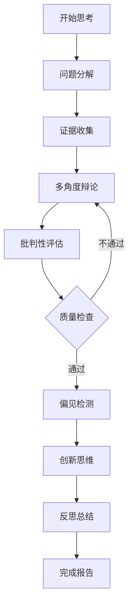

# 深度思考流程详解

本文档详细介绍Deep Thinking Engine中各种思维流程的具体步骤、使用方法和最佳实践。

## 流程概览

Deep Thinking Engine提供两种主要的思维流程：

1. **全面分析流程** (comprehensive_analysis) - 适用于复杂问题的深度分析
2. **快速分析流程** (quick_analysis) - 适用于简单问题或时间有限的情况

## 全面分析流程 (Comprehensive Analysis)

### 流程图



### 第一步：问题分解 (Problem Decomposition)

**目标**: 将复杂问题分解为可管理的子问题

**执行方式**:
```
使用start_thinking工具，系统会返回问题分解的Prompt模板
```

**输出要求**:
```json
{
  "main_question": "主要问题",
  "sub_questions": [
    {
      "id": "1",
      "question": "子问题描述",
      "priority": "high|medium|low",
      "search_keywords": ["关键词1", "关键词2"],
      "expected_perspectives": ["角度1", "角度2"]
    }
  ],
  "relationships": [
    {"from": "1", "to": "2", "type": "prerequisite|parallel|dependent"}
  ]
}
```

**质量标准**:
- 子问题数量：3-7个
- 相互独立性：每个子问题可独立分析
- 完整覆盖：涵盖主问题的所有重要方面
- 逻辑清晰：问题间关系明确

**常见错误**:
- ❌ 子问题过于宽泛："教育问题有哪些？"
- ❌ 子问题重叠："成本问题"和"经济影响"
- ❌ 遗漏关键维度：只考虑技术不考虑社会影响

**改进建议**:
- ✅ 使用5W1H方法：What, Why, Who, When, Where, How
- ✅ 考虑不同利益相关者的视角
- ✅ 平衡短期和长期影响

### 第二步：证据收集 (Evidence Collection)

**目标**: 为每个子问题收集可靠、多样化的证据

**执行方式**:
```
使用next_step工具，系统会为每个子问题提供证据收集指导
```

**搜索策略**:
1. **学术来源**: 搜索学术论文、研究报告
2. **权威机构**: 政府报告、国际组织数据
3. **新闻媒体**: 最新发展和案例分析
4. **专家观点**: 行业专家的分析和评论

**输出格式**:
```json
{
  "sub_question_id": "1",
  "evidence_sources": [
    {
      "source_type": "academic|government|media|expert",
      "title": "来源标题",
      "url": "链接地址",
      "credibility_score": 0.8,
      "key_findings": ["发现1", "发现2"],
      "publication_date": "2024-01-01",
      "relevance_score": 0.9
    }
  ],
  "conflicting_information": [
    {
      "conflict_description": "冲突描述",
      "sources": ["来源A", "来源B"],
      "resolution_needed": true
    }
  ]
}
```

**质量标准**:
- 来源多样性：至少3种不同类型的来源
- 时效性：优先使用近期数据
- 可信度：平均可信度评分 ≥ 0.7
- 相关性：与子问题直接相关

**证据评估清单**:
- [ ] 来源权威性如何？
- [ ] 数据是否最新？
- [ ] 是否存在利益冲突？
- [ ] 样本规模是否足够？
- [ ] 方法论是否可靠？

### 第三步：多角度辩论 (Multi-Perspective Debate)

**目标**: 从不同立场分析问题，避免单一视角局限

**角色设定**:
1. **支持方** (Proponent): 支持某种观点或方案
2. **反对方** (Opponent): 质疑或反对该观点
3. **中立方** (Neutral Analyst): 客观分析各方观点

**辩论流程**:
```
第一轮：各方陈述核心观点 (150字以内)
第二轮：相互质疑和反驳 (100字以内)
第三轮：最终总结各方最强论点
```

**输出格式**:
```json
{
  "debate_topic": "辩论主题",
  "rounds": [
    {
      "round": 1,
      "proponent": "支持方观点",
      "opponent": "反对方观点", 
      "neutral": "中立方分析"
    }
  ],
  "final_summary": {
    "strongest_arguments": {
      "proponent": "最强支持论据",
      "opponent": "最强反对论据",
      "neutral": "平衡分析"
    },
    "key_disagreements": ["分歧点1", "分歧点2"],
    "areas_of_consensus": ["共识点1", "共识点2"]
  }
}
```

**质量标准**:
- 论据充分：每个观点都有证据支撑
- 逻辑清晰：推理过程合理
- 相互回应：各方真正对话而非独白
- 深度分析：触及问题本质

### 第四步：批判性评估 (Critical Evaluation)

**目标**: 使用Paul-Elder九大标准评估论证质量

**评估维度**:
1. **准确性** (Accuracy): 信息是否准确无误？
2. **精确性** (Precision): 表述是否具体明确？
3. **相关性** (Relevance): 内容是否与主题相关？
4. **逻辑性** (Logic): 推理是否合乎逻辑？
5. **广度** (Breadth): 是否考虑了多个角度？
6. **深度** (Depth): 分析是否深入透彻？
7. **重要性** (Significance): 关注的是否为核心问题？
8. **公正性** (Fairness): 是否存在偏见？
9. **清晰性** (Clarity): 表达是否清晰易懂？

**评分标准**:
- 9-10分：优秀，无明显问题
- 7-8分：良好，有小幅改进空间
- 5-6分：一般，需要明显改进
- 3-4分：较差，存在严重问题
- 1-2分：很差，需要重新分析

**输出格式**:
```json
{
  "evaluation_results": {
    "accuracy": {"score": 8, "reasoning": "评分理由"},
    "precision": {"score": 7, "reasoning": "评分理由"},
    "relevance": {"score": 9, "reasoning": "评分理由"},
    "logic": {"score": 6, "reasoning": "评分理由"},
    "breadth": {"score": 8, "reasoning": "评分理由"},
    "depth": {"score": 7, "reasoning": "评分理由"},
    "significance": {"score": 9, "reasoning": "评分理由"},
    "fairness": {"score": 8, "reasoning": "评分理由"},
    "clarity": {"score": 7, "reasoning": "评分理由"}
  },
  "overall_score": 7.7,
  "strengths": ["优势1", "优势2"],
  "weaknesses": ["不足1", "不足2"],
  "improvement_suggestions": ["建议1", "建议2"],
  "quality_gate_passed": true
}
```

**质量门槛**:
- 综合得分 ≥ 7.0：通过质量检查
- 综合得分 < 7.0：需要改进后重新评估
- 任一维度 < 5.0：必须改进该维度

### 第五步：偏见检测 (Bias Detection)

**目标**: 识别和缓解认知偏误，提高思考质量

**常见偏见类型**:
1. **确认偏误** (Confirmation Bias): 只寻找支持既有观点的信息
2. **锚定效应** (Anchoring Bias): 过度依赖最初获得的信息
3. **可得性启发** (Availability Heuristic): 基于容易想起的例子判断
4. **代表性启发** (Representativeness Heuristic): 基于刻板印象判断
5. **过度自信** (Overconfidence Bias): 对自己的判断过于确信
6. **后见之明偏误** (Hindsight Bias): 认为结果"早就可以预见"

**检测方法**:
```json
{
  "bias_analysis": {
    "confirmation_bias": {
      "detected": true,
      "evidence": "具体表现",
      "severity": "high|medium|low",
      "mitigation": "缓解建议"
    },
    "anchoring_bias": {
      "detected": false,
      "evidence": null,
      "severity": null,
      "mitigation": null
    }
  },
  "overall_bias_risk": "medium",
  "priority_mitigations": ["优先缓解措施1", "优先缓解措施2"]
}
```

**缓解策略**:
- **确认偏误**: 主动寻找反对证据
- **锚定效应**: 考虑多个起始点
- **可得性启发**: 查找统计数据
- **代表性启发**: 考虑基础概率
- **过度自信**: 列出不确定因素
- **后见之明偏误**: 记录预测过程

### 第六步：创新思维 (Innovation Thinking)

**目标**: 使用SCAMPER和TRIZ方法激发突破性思维

**SCAMPER技法**:
- **S - Substitute** (替代): 可以用什么来替代？
- **C - Combine** (结合): 可以将哪些元素结合？
- **A - Adapt** (适应): 可以从其他领域借鉴什么？
- **M - Modify** (修改): 可以放大或缩小什么？
- **P - Put to Other Uses** (其他用途): 还有什么其他用途？
- **E - Eliminate** (消除): 可以去掉什么不必要的部分？
- **R - Reverse/Rearrange** (逆转/重组): 能否颠倒顺序或角色？

**TRIZ原理应用**:
从40个创新原理中选择适用的原理：
1. 分割原理
2. 抽取原理
3. 局部质量原理
4. 不对称原理
5. 合并原理
... (根据具体问题选择)

**输出格式**:
```json
{
  "scamper_analysis": {
    "substitute": ["替代方案1", "替代方案2"],
    "combine": ["结合想法1", "结合想法2"],
    "adapt": ["适应方案1", "适应方案2"],
    "modify": ["修改建议1", "修改建议2"],
    "put_to_other_uses": ["新用途1", "新用途2"],
    "eliminate": ["简化建议1", "简化建议2"],
    "reverse": ["逆转想法1", "逆转想法2"]
  },
  "triz_principles": [
    {
      "principle": "分割原理",
      "application": "具体应用方式",
      "potential_solution": "潜在解决方案"
    }
  ],
  "innovation_ideas": [
    {
      "idea": "创新想法描述",
      "novelty_score": 8,
      "feasibility_score": 6,
      "value_potential": 9,
      "implementation_difficulty": 7
    }
  ]
}
```

### 第七步：反思��结 (Reflection)

**目标**: 通过苏格拉底式提问引导元认知思考

**反思维度**:
1. **过程反思**: 思维过程是否合理？
2. **结果反思**: 结论的确定性如何？
3. **元认知反思**: 思维模式和盲点是什么？

**苏格拉底式提问**:
- 我是如何得出这些结论的？
- 我考虑了哪些角度？
- 我的证据是否充分？
- 我的结论有多确定？
- 如果我错了会怎样？
- 还有其他可能的解释吗？
- 我的思维模式如何？
- 我学到了什么？
- 下次如何改进？

**输出格式**:
```json
{
  "reflection_analysis": {
    "process_reflection": {
      "thinking_methods_used": ["方法1", "方法2"],
      "reasoning_quality": "评估",
      "missed_perspectives": ["遗漏角度1", "遗漏角度2"]
    },
    "outcome_reflection": {
      "confidence_level": 0.8,
      "uncertainty_areas": ["不确定领域1", "不确定领域2"],
      "alternative_explanations": ["替代解释1", "替代解释2"]
    },
    "metacognitive_reflection": {
      "thinking_patterns": ["思维模式1", "思维模式2"],
      "blind_spots": ["盲点1", "盲点2"],
      "learning_insights": ["洞察1", "洞察2"]
    }
  },
  "final_summary": {
    "core_insights": ["核心洞察1", "核心洞察2"],
    "main_takeaways": ["主要收获1", "主要收获2"],
    "action_plan": ["行动计划1", "行动计划2"],
    "continuing_questions": ["持续思考的问题1", "持续思考的问题2"]
  }
}
```

## 快速分析流程 (Quick Analysis)

### 适用场景
- 时间有限的情况
- 相对简单的问题
- 初步探索性分析
- 决策支持需求

### 流程步骤

#### 1. 简化分解 (Simple Decomposition)
- 将问题分解为2-4个核心子问题
- 快速识别关键影响因素
- 设定基本的分析框架

#### 2. 基础证据收集 (Basic Evidence)
- 收集最相关的2-3个证据源
- 重点关注权威和最新信息
- 快速评估信息可信度

#### 3. 快速评估 (Quick Evaluation)
- 使用简化的评估标准
- 重点关注逻辑性和相关性
- 识别明显的问题和机会

#### 4. 简要反思 (Brief Reflection)
- 总结核心发现
- 识别主要不确定性
- 提出下一步建议

## 流程选择指南

### 选择全面分析流程的情况：
- 问题复杂度高，涉及多个维度
- 决策影响重大，需要深入分析
- 有充足的时间进行全面思考
- 需要高质量的分析结果

### 选择快速分析流程的情况：
- 问题相对简单明确
- 时间紧迫，需要快速决策
- 进行初步探索或可行性评估
- 作为全面分析的前期准备

## 流程定制

### 自定义流程步骤
您可以根据特定需求定制思维流程：

```yaml
custom_flows:
  technical_analysis:
    name: "技术方案分析"
    steps:
      - step: "requirement_analysis"
        template: "technical_requirements"
      - step: "solution_design"
        template: "architecture_design"
      - step: "risk_assessment"
        template: "technical_risks"
      - step: "implementation_plan"
        template: "development_plan"
```

### 领域特定模板
为不同领域创建专门的模板：

- **商业分析**: 市场、竞争、财务分析模板
- **技术评估**: 架构、性能、安全评估模板
- **政策研究**: 利益相关者、影响评估模板
- **学术研究**: 文献综述、理论框架模板

## 质量保证

### 流程质量指标
- **完整性**: 是否完成所有必要步骤
- **深度**: 分析是否足够深入
- **广度**: 是否考虑多个角度
- **逻辑性**: 推理是否合理
- **证据支撑**: 结论是否有充分证据

### 质量改进建议
1. **定期回顾**: 检查分析过程的质量
2. **同行评议**: 请他人审查分析结果
3. **迭代改进**: 根据反馈不断完善
4. **学习总结**: 记录经验教训和最佳实践

通过系统性地使用这些思维流程，您可以显著提高分析质量，做出更好的决策，并培养更强的批判性思维能力。